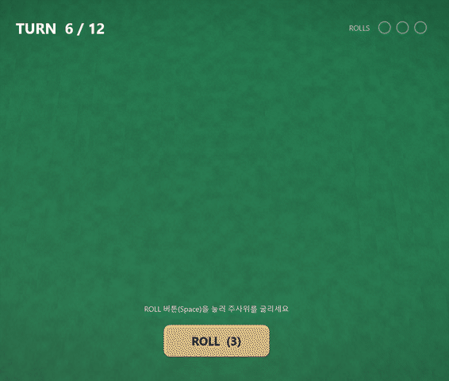
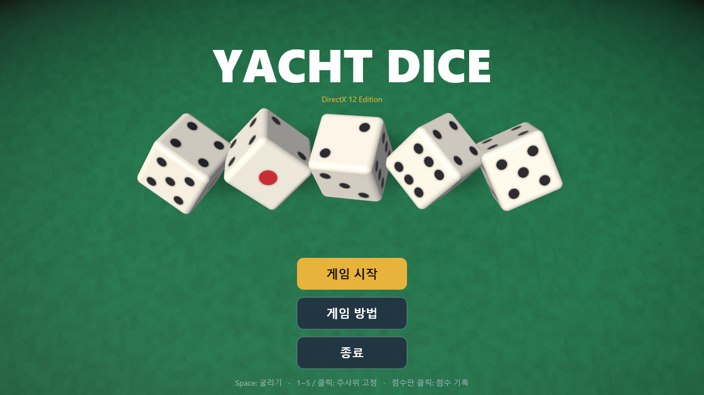
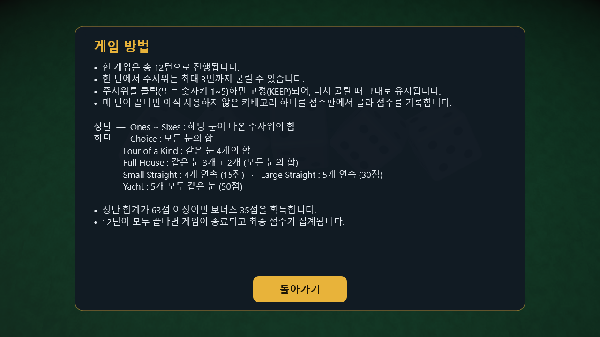
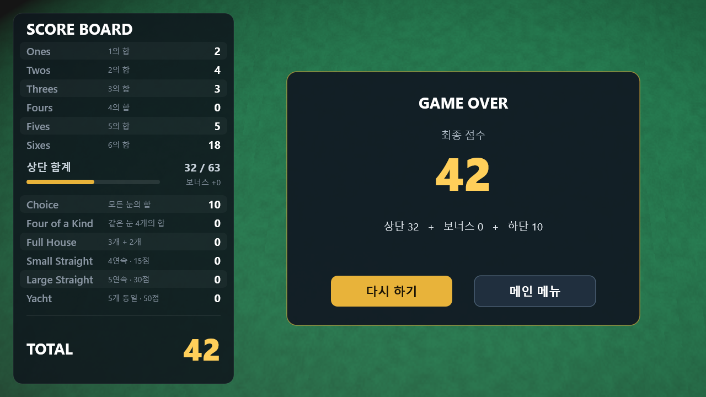
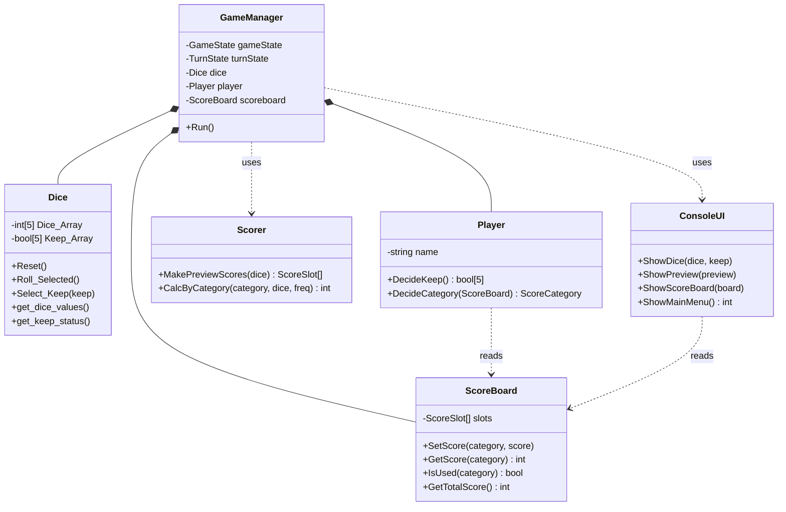
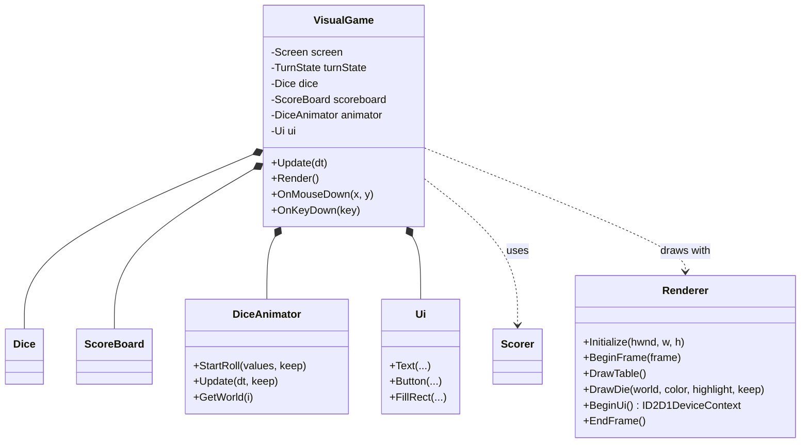

# YachtDice

C++로 만든 요트 다이스(Yacht Dice) 게임입니다.
처음에는 **콘솔 텍스트 게임**으로 만들었고, 같은 게임 로직을 그대로 사용해 **DirectX 12 기반 3D 그래픽 버전**으로 확장했습니다.


<p align="center">
  
</p>

## 스크린샷

| 메인 메뉴 | 게임 플레이 |
| :---: | :---: |
|  |  |
| **게임 방법** | **게임 종료** |
|  |  |

## 주요 특징

- **3D 주사위:** 모서리가 둥근 주사위를 실시간으로 렌더링합니다. 주사위 눈은 텍스처 이미지 없이 셰이더 코드로 직접 그립니다.
- **굴리기 애니메이션:** 주사위가 테이블 위로 날아와 튕기며 회전하다가 결과 눈이 위를 향하도록 정확히 착지합니다.
- **마우스 중심 조작:** 주사위를 클릭해 고정(KEEP)하고, 점수판에서 카테고리를 클릭해 점수를 기록합니다.
- **점수 미리보기:** 아직 사용하지 않은 카테고리마다 현재 주사위로 얻을 점수가 표시됩니다.
- **상단 보너스 진행도:** 상단 합계가 63점에 얼마나 가까운지 게이지로 보여줍니다.
- **한글 UI:** Direct2D/DirectWrite로 선명한 한글 텍스트를 출력합니다.
- **창 크기 자유:** 창 크기를 바꾸거나 고해상도(High DPI) 모니터에서도 화면 비율이 유지됩니다.
- **게임 로직 재사용:** 콘솔 버전의 `Dice`, `Scorer`, `ScoreBoard` 클래스를 수정 없이 공유합니다.

## 게임 규칙

- 한 게임은 총 12턴으로 진행됩니다.
- 한 턴에서 주사위는 최대 3번까지 굴릴 수 있으며, 원하는 주사위를 유지(keep)한 채 나머지만 다시 굴릴 수 있습니다.
- 매 턴이 끝나면 아직 사용하지 않은 점수 카테고리 중 하나를 선택해 점수를 기록합니다.
- 상단 카테고리 합계가 63점 이상이면 보너스 35점을 획득합니다.
- 12턴이 모두 끝나면 게임이 종료되고 최종 점수가 집계됩니다.

| 구분 | 카테고리 | 점수 계산 |
| --- | --- | --- |
| 상단 | Ones ~ Sixes | 해당 눈이 나온 주사위의 합 |
| 하단 | Choice | 모든 눈의 합 |
| 하단 | Four of a Kind | 같은 눈 4개의 합 |
| 하단 | Full House | 같은 눈 3개 + 2개일 때 모든 눈의 합 |
| 하단 | Small Straight | 4개 연속이면 15점 |
| 하단 | Large Straight | 5개 연속이면 30점 |
| 하단 | Yacht | 5개 모두 같은 눈이면 50점 |

## 조작 방법

### DirectX 12 버전

| 입력 | 동작 |
| --- | --- |
| `ROLL` 버튼 / `Space` / `Enter` | 주사위 굴리기 (턴당 최대 3회) |
| 주사위 클릭 / `1` ~ `5` | 주사위 고정(KEEP) / 해제 |
| 점수판 행 클릭 | 해당 카테고리에 점수 기록 후 다음 턴 |
| `Esc` | 게임 방법·게임 종료 화면에서 메인 메뉴로 |

### 콘솔 버전

- 메인 메뉴에서 `1`을 입력하면 게임을 시작하고, `2`는 게임 방법 설명, `3`은 종료입니다.
- 각 굴림 후 계속 굴릴지 여부를 `1`(예) 또는 `0`(아니오)으로 입력합니다.
- 이후 안내에 따라 유지할 주사위와 기록할 점수 카테고리를 선택합니다.

## 빌드 및 실행 방법

1. **Visual Studio 2022**(플랫폼 도구 세트 v143)와 **"C++를 사용한 데스크톱 개발"** 워크로드를 설치합니다. Windows 10/11 SDK가 함께 설치되며, DirectX 12는 SDK에 포함되어 있어 따로 설치할 것이 없습니다.
2. `YachtDice.sln`을 Visual Studio로 엽니다.
3. 솔루션 탐색기에서 실행할 프로젝트를 오른쪽 클릭 → **시작 프로젝트로 설정**합니다.
   - `YachtDiceDX12` : DirectX 12 그래픽 버전 (x64 전용)
   - `YachtDice` : 콘솔 버전
4. 구성(Debug/Release)과 플랫폼 **x64**를 선택하고 `F5`(또는 `Ctrl+F5`)로 실행합니다.
5. 실행 파일은 `x64\Debug\` 또는 `x64\Release\` 폴더에 생성됩니다.

> DirectX 12를 지원하는 그래픽 카드가 없으면 자동으로 소프트웨어 렌더러(WARP)로 실행됩니다.

## 프로젝트 구조

```
YachtDice/
├─ YachtDice.sln
├─ YachtDice/                 # 콘솔 버전 + 공용 게임 로직
│  ├─ Dice.h / .cpp           #   주사위 5개 값과 KEEP 상태      ← DX12 버전과 공유
│  ├─ Scorer.h / .cpp         #   카테고리별 점수 계산            ← DX12 버전과 공유
│  ├─ ScoreBoard.h / .cpp     #   점수판(기록, 상단 합계, 보너스) ← DX12 버전과 공유
│  ├─ ScoreCategory.h         #   12개 카테고리 열거형            ← DX12 버전과 공유
│  ├─ GameManager.h / .cpp    #   콘솔 게임 흐름
│  ├─ Player.h / .cpp         #   콘솔 입력
│  ├─ ConsoleUI.h / .cpp      #   콘솔 출력
│  └─ YachtDice.cpp           #   main()
├─ YachtDiceDX12/             # DirectX 12 그래픽 버전
│  ├─ Main.cpp                #   창 생성, 메시지 처리, 게임 루프
│  ├─ VisualGame.h / .cpp     #   게임 흐름(상태 머신), 입력, 화면 구성
│  ├─ Renderer.h / .cpp       #   Direct3D 12 + Direct2D 렌더링
│  ├─ DiceAnimator.h / .cpp   #   주사위 굴리기 애니메이션
│  ├─ DiceMesh.h / .cpp       #   둥근 주사위·테이블 3D 모델 생성
│  ├─ Shaders.h               #   HLSL 셰이더 (조명, 주사위 눈, 그림자)
│  └─ Ui.h / .cpp             #   버튼·텍스트 등 2D UI 그리기 도우미
└─ docs/
   ├─ DX12_GUIDE.md           # DirectX 12 버전 상세 설명서
   └─ images/                 # README 이미지
```

## 클래스 구조

### 공용 게임 로직 + 콘솔 버전

C++ 클래스 활용을 복습하기 위해 게임 로직을 역할별로 나누었습니다. 게임 진행, 주사위, 플레이어 입력, 점수 계산, 점수판, 화면 출력을 각각 별도의 클래스로 분리했습니다.

| 클래스 | 역할 |
| --- | --- |
| `GameManager` | 게임 상태(`GameState`)와 턴 진행 상태(`TurnState`)를 관리하며 전체 게임 흐름을 제어합니다. |
| `Dice` | 주사위 5개의 값과 유지(keep) 여부를 관리하고 굴리는 기능을 제공합니다. |
| `Player` | 주사위 유지 여부와 점수 카테고리 선택 등 플레이어의 입력을 처리합니다. |
| `Scorer` | 주사위 조합을 카테고리별 점수로 계산합니다. |
| `ScoreBoard` | 카테고리별 획득 점수, 상단 합계, 보너스, 총점을 관리합니다. |
| `ScoreCategory` | 12개 점수 카테고리를 정의하는 열거형입니다. |
| `ConsoleUI` | 주사위 상태, 점수 미리보기, 점수판, 메인 메뉴 등을 콘솔에 출력합니다. |



### DirectX 12 버전

콘솔 버전의 `GameManager` / `Player` / `ConsoleUI` 자리를 `VisualGame` / 마우스·키보드 입력 / `Renderer`+`Ui`가 대신합니다. 점수 규칙을 담당하는 `Dice`, `Scorer`, `ScoreBoard`는 그대로 재사용합니다.

| 클래스 | 역할 |
| --- | --- |
| `VisualGame` | 화면 상태(메뉴/게임 방법/플레이/종료)와 턴 상태(굴리기 대기/굴리는 중/선택)를 관리하고, 입력을 받아 게임 로직을 호출합니다. |
| `Renderer` | Direct3D 12로 3D 장면(테이블, 주사위)을 그리고, 그 위에 Direct2D로 UI를 겹쳐 그립니다. |
| `DiceAnimator` | 굴린 결과에 맞춰 주사위가 날아와 착지하는 위치·회전 애니메이션을 계산합니다. |
| `Ui` | 사각형, 원, 텍스트, 버튼 같은 2D 요소를 그리는 도우미입니다. |
| `DiceMesh` | 둥근 주사위와 테이블의 정점/인덱스 데이터를 코드로 생성합니다. |



## 기술 스택

| 영역 | 사용 기술 |
| --- | --- |
| 언어 | C++17 |
| 3D 렌더링 | Direct3D 12, HLSL (Shader Model 5.0), DirectXMath |
| 2D UI / 텍스트 | Direct2D, DirectWrite (D3D11On12로 Direct3D 12 화면 위에 출력) |
| 창 / 입력 | Win32 API |
| 빌드 | Visual Studio 2022 (MSBuild, v143) |

DirectX 12 버전이 어떻게 동작하는지(그래픽스 기초 개념, 초기화 과정, 한 프레임이 그려지는 순서, 셰이더, 애니메이션, 값 바꿔보기 실습 등)는
👉 **[docs/DX12_GUIDE.md](docs/DX12_GUIDE.md)** 에 자세히 정리했습니다.

## 프로젝트 목적

C++ 클래스 활용을 복습하기 위해 만든 학습용 프로그램입니다. 평소 문제를 풀 때 클래스를 잘 사용하지 않는 편이라, 게임 로직을 역할별로 나누어 클래스로 설계해보는 연습을 목표로 제작했습니다.

이후 **역할을 잘 나눠둔 클래스는 화면 출력 방식이 바뀌어도 재사용할 수 있다**는 점을 확인하기 위해, 게임 로직은 그대로 두고 출력 부분만 DirectX 12로 교체한 그래픽 버전을 추가했습니다.
