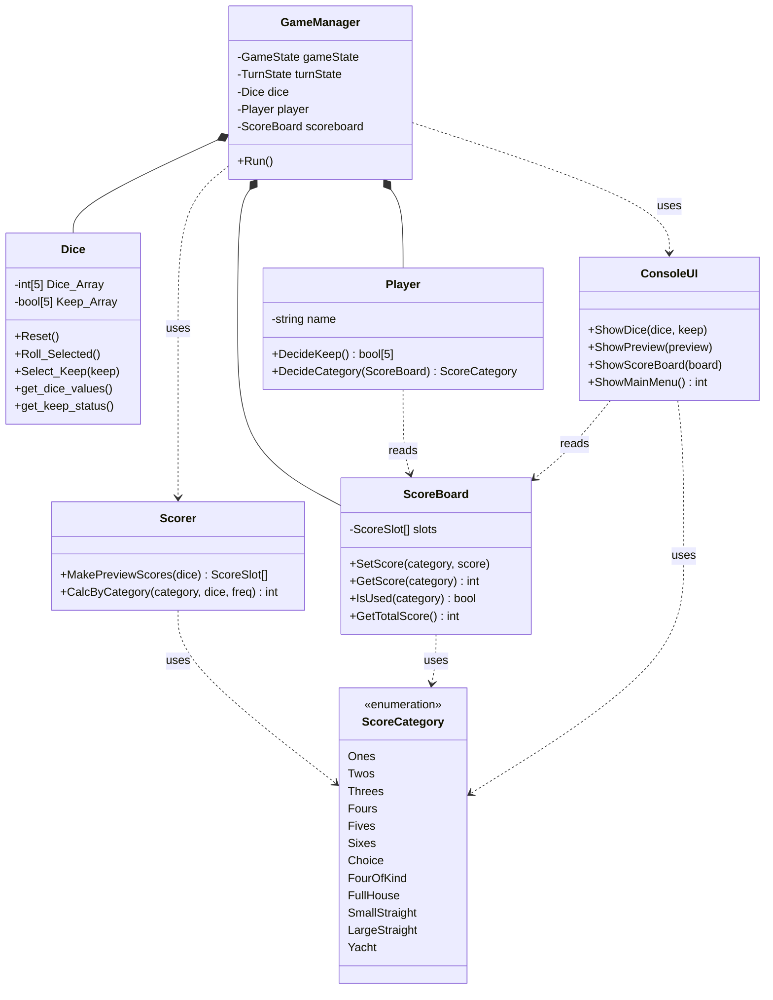

# YachtDice

콘솔 환경에서 동작하는 요트 다이스(Yacht Dice) 게임입니다. C++로 작성했습니다.

## 프로젝트 목적

C++ 클래스 활용을 복습하기 위해 만든 학습용 프로그램입니다. 평소 문제를 풀 때 클래스를 잘 사용하지 않는 편이라, 게임 로직을 역할별로 나누어 클래스로 설계해보는 연습을 목표로 제작했습니다. 게임 진행, 주사위, 플레이어 입력, 점수 계산, 점수판, 화면 출력을 각각 별도의 클래스로 분리했습니다.

## 게임 규칙

- 한 게임은 총 12턴으로 진행됩니다.
- 한 턴에서 주사위는 최대 3번까지 굴릴 수 있으며, 원하는 주사위를 유지(keep)한 채 나머지만 다시 굴릴 수 있습니다.
- 매 턴이 끝나면 아직 사용하지 않은 점수 카테고리 중 하나를 선택해 점수를 기록합니다.
- 점수 카테고리는 다음 12개입니다.
  - 상단: Ones, Twos, Threes, Fours, Fives, Sixes
  - 하단: Choice, Four of a Kind, Full House, Small Straight, Large Straight, Yacht
- 상단 카테고리 합계가 63점 이상이면 보너스 점수를 획득합니다.
- 12턴이 모두 끝나면 게임이 종료되고 최종 점수가 집계됩니다.

## 클래스 구조

| 클래스 | 역할 |
| --- | --- |
| `GameManager` | 게임 상태(`GameState`)와 턴 진행 상태(`TurnState`)를 관리하며 전체 게임 흐름을 제어합니다. |
| `Dice` | 주사위 5개의 값과 유지(keep) 여부를 관리하고 굴리는 기능을 제공합니다. |
| `Player` | 주사위 유지 여부와 점수 카테고리 선택 등 플레이어의 입력을 처리합니다. |
| `Scorer` | 주사위 조합을 카테고리별 점수로 계산합니다. |
| `ScoreBoard` | 카테고리별 획득 점수, 상단 합계, 보너스, 총점을 관리합니다. |
| `ScoreCategory` | 12개 점수 카테고리를 정의하는 열거형입니다. |
| `ConsoleUI` | 주사위 상태, 점수 미리보기, 점수판, 메인 메뉴 등을 콘솔에 출력합니다. |

`GameManager`가 각 클래스를 조합해 게임을 진행시키고, 나머지 클래스는 각자의 책임(주사위 상태, 점수 계산, 점수 저장, 화면 출력 등)만 담당하도록 나누었습니다.

## 빌드 및 실행 방법

1. Visual Studio 2022 이상(플랫폼 도구 세트 v143)이 필요합니다.
2. `YachtDice.sln` 파일을 Visual Studio로 엽니다.
3. 원하는 구성(Debug/Release)과 플랫폼(x64/Win32)을 선택한 뒤 빌드합니다.
4. 빌드가 완료되면 생성된 실행 파일을 실행합니다.

## 조작 방법

- 메인 메뉴에서 `1`을 입력하면 게임을 시작하고, `2`는 게임 방법 설명, `3`은 종료입니다.
- 각 굴림 후 계속 굴릴지 여부를 `1`(예) 또는 `0`(아니오)으로 입력합니다.
- 이후 안내에 따라 유지할 주사위와 기록할 점수 카테고리를 선택합니다.
