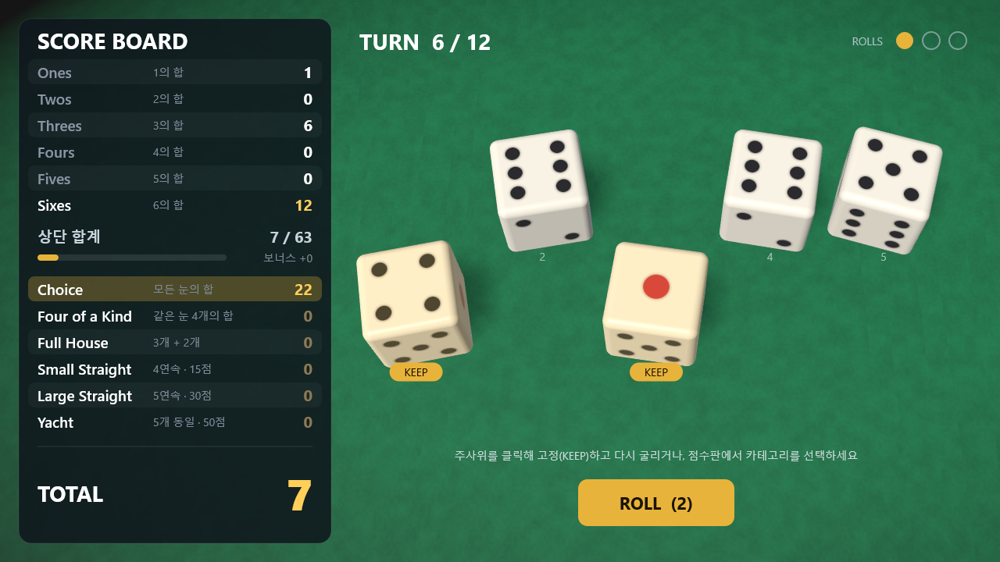
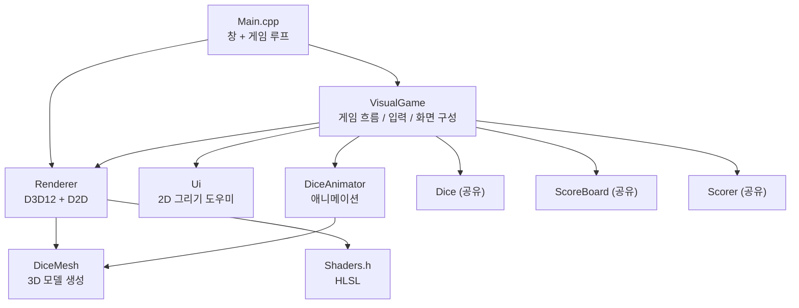
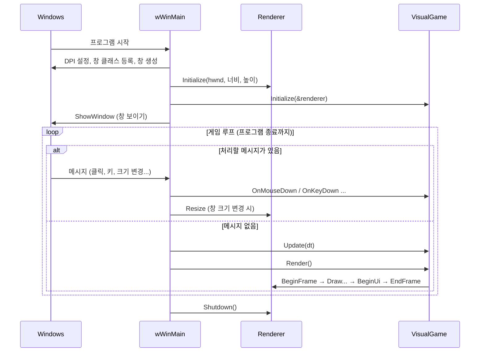
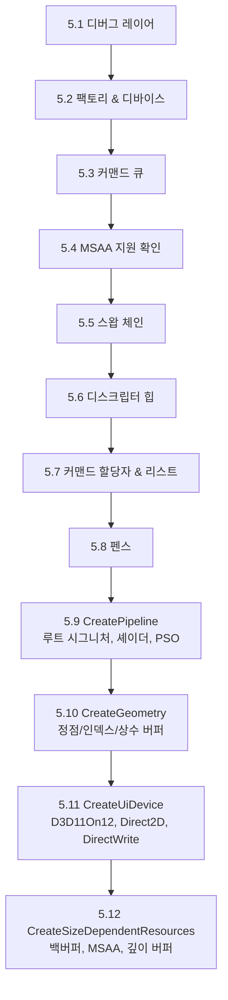
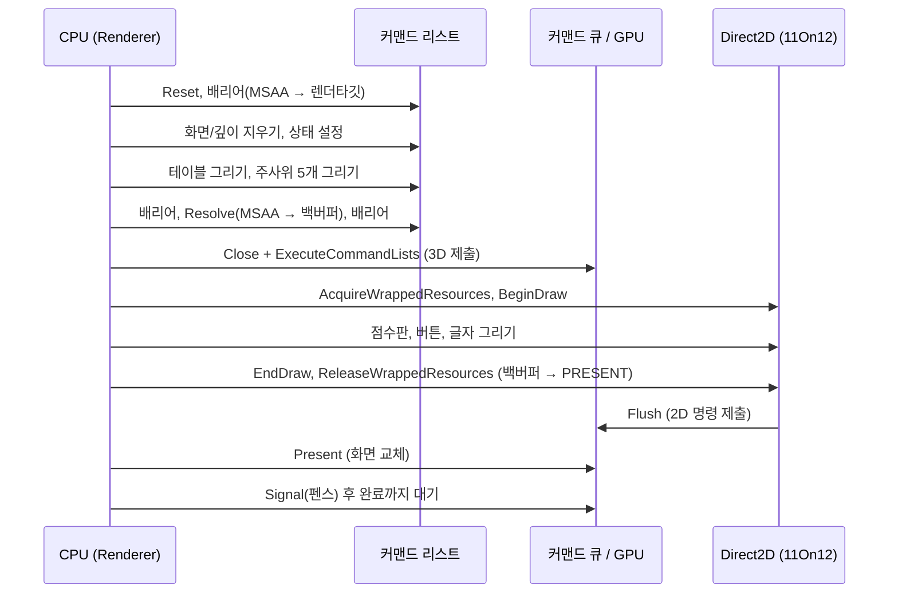
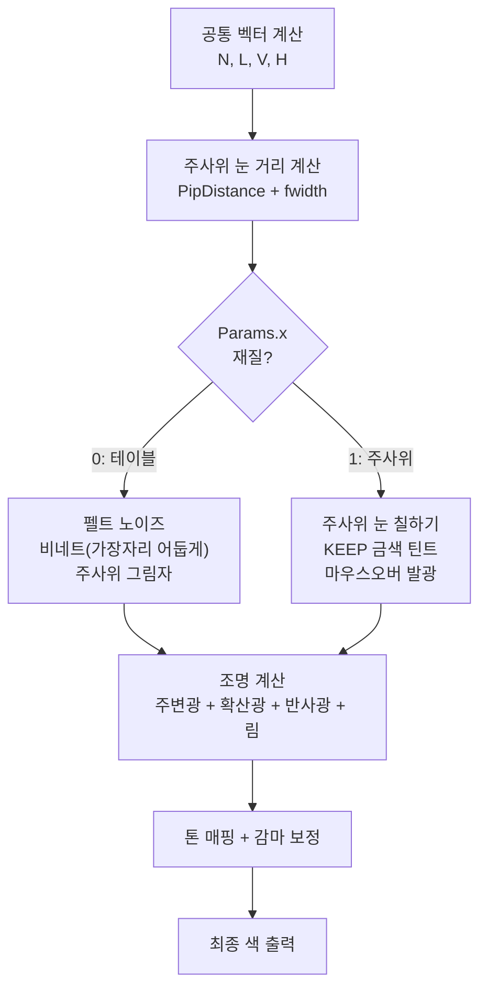
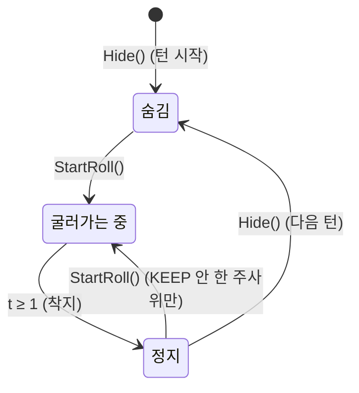
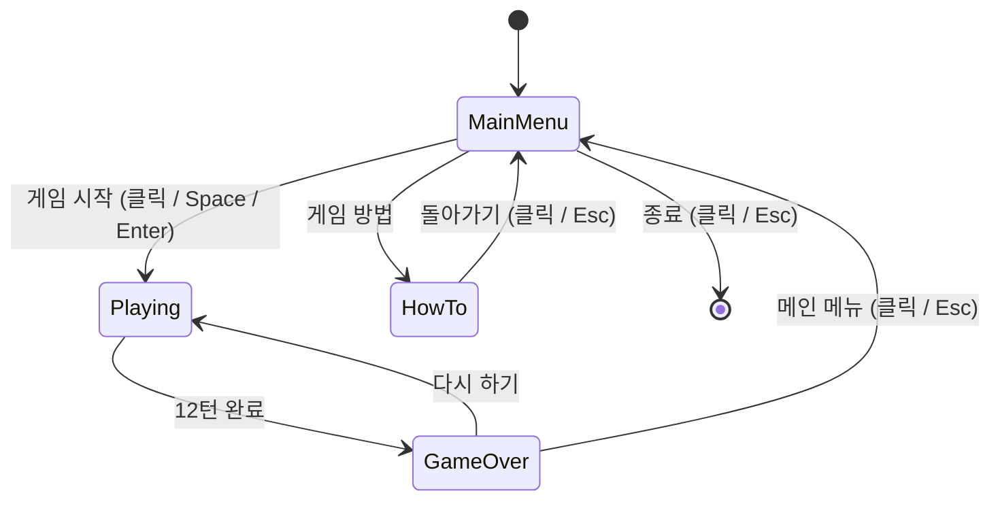
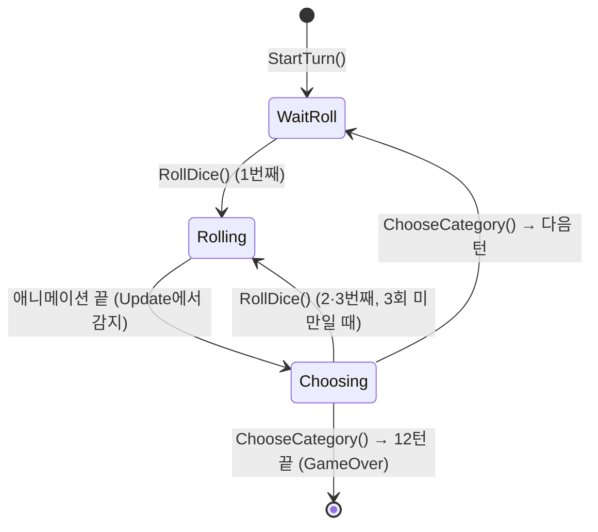

# YachtDice DirectX 12 버전 설명서

> 이 문서는 **C++와 클래스는 알지만 DirectX나 그래픽스 프로그래밍은 처음**인 사람을 위해 썼습니다.
> 콘솔 게임이었던 YachtDice가 어떻게 3D 그래픽 게임이 되었는지, 코드 한 줄 한 줄이 왜 필요한지를 처음부터 설명합니다.



---

## 목차

0. [이 문서를 읽는 방법](#0-이-문서를-읽는-방법)
1. [한눈에 보기: 무엇이 바뀌었나](#1-한눈에-보기-무엇이-바뀌었나)
2. [파일 구성과 의존 관계](#2-파일-구성과-의존-관계)
3. [프로그램 전체 실행 흐름 (Main.cpp)](#3-프로그램-전체-실행-흐름-maincpp)
4. [그래픽스 기초 개념](#4-그래픽스-기초-개념)
5. [Renderer 해부 ① 초기화](#5-renderer-해부--초기화)
6. [Renderer 해부 ② 한 프레임이 그려지는 과정](#6-renderer-해부--한-프레임이-그려지는-과정)
7. [주사위 3D 모델 만들기 (DiceMesh)](#7-주사위-3d-모델-만들기-dicemesh)
8. [셰이더 (Shaders.h)](#8-셰이더-shadersh)
9. [카메라와 화면 좌표 (VisualGame)](#9-카메라와-화면-좌표-visualgame)
10. [주사위 애니메이션 (DiceAnimator)](#10-주사위-애니메이션-diceanimator)
11. [2D UI 그리기 (Ui + Direct2D)](#11-2d-ui-그리기-ui--direct2d)
12. [게임 흐름 (VisualGame)](#12-게임-흐름-visualgame)
13. [직접 바꿔보기 (실습)](#13-직접-바꿔보기-실습)
14. [디버깅과 문제 해결](#14-디버깅과-문제-해결)
15. [한계와 개선 아이디어](#15-한계와-개선-아이디어)
16. [용어 사전](#16-용어-사전)
17. [더 공부하기](#17-더-공부하기)

---

## 0. 이 문서를 읽는 방법

- **1~3장**은 큰 그림입니다. 코드를 몰라도 읽을 수 있습니다. 여기만 읽어도 "무엇을 왜 했는지"는 알 수 있습니다.
- **4장**은 DirectX를 이해하는 데 필요한 그래픽스 기초 개념입니다. 5장 이후가 어렵게 느껴지면 4장으로 돌아오세요.
- **5~12장**은 실제 코드를 파일/함수 단위로 따라가며 설명합니다. Visual Studio에서 해당 파일을 열어 두고 같이 보는 것을 추천합니다.
- **13장**은 숫자 몇 개를 바꿔 보면서 코드가 화면에 어떤 영향을 주는지 체험하는 실습입니다. 이해가 가장 빨리 되는 방법입니다.
- **16장 용어 사전**은 모르는 단어가 나올 때마다 찾아보세요.

> 💡 **처음부터 다 이해하려 하지 않아도 됩니다.** DirectX 12는 전문가에게도 장황한 API입니다. 이 프로젝트에서 "초기화 코드"(5장)는 한 번 만들어 두면 거의 손댈 일이 없고, 실제로 게임을 바꿀 때 자주 만지는 곳은 `VisualGame.cpp`, `DiceAnimator.cpp`, `Shaders.h`입니다.

---

## 1. 한눈에 보기: 무엇이 바뀌었나

### 1.1 콘솔 게임 vs 그래픽 게임

| | 콘솔 버전 | DirectX 12 버전 |
| --- | --- | --- |
| 화면 출력 | `std::cout`으로 글자 출력 | GPU가 초당 약 60번 화면 전체를 다시 그림 |
| 입력 | `std::cin >> x` 가 입력될 때까지 **멈춰서 기다림** | 윈도우가 마우스/키보드 **이벤트(메시지)** 를 보내줌 |
| 흐름 제어 | `while(true)` + `switch` + 블로킹 입력 | **게임 루프**: 매 프레임 `Update()` → `Render()` |
| 주사위 표현 | 숫자 `3` | 3D 주사위 모델 + 굴러가는 애니메이션 |
| 점수판 | 텍스트 줄 | 클릭 가능한 2D 패널 |

### 1.2 핵심 아이디어 ① 게임 루프

콘솔 버전의 `GameManager`는 이런 구조입니다.

```cpp
std::cin >> cont;   // 사용자가 입력할 때까지 프로그램이 여기서 멈춤
```

그래픽 게임에서는 **절대 멈추면 안 됩니다.** 사용자가 아무것도 안 하고 있어도 메인 메뉴의 주사위는 계속 돌고 있어야 하고, 주사위가 굴러가는 1초 동안에도 화면은 60번 다시 그려져야 하기 때문입니다.

그래서 구조가 이렇게 바뀝니다.

```
while (프로그램이 안 끝났으면) {
    1. 윈도우 메시지(마우스 클릭, 키 입력 등)가 있으면 처리한다   → 상태만 바꾸고 바로 돌아옴
    2. Update(dt) : 시간이 dt초 흘렀다고 보고 애니메이션 등을 갱신
    3. Render()   : 현재 상태를 화면에 그림
}
```

입력은 "기다려서 받는 것"이 아니라 "들어오면 처리하는 것"이 됩니다. 예를 들어 사용자가 ROLL 버튼을 클릭하면 `VisualGame::OnMouseDown()`이 호출되고, 여기서 `RollDice()`를 불러 상태를 바꾼 뒤 즉시 리턴합니다. 그 후의 프레임들에서 `Update()`가 주사위를 조금씩 움직이고 `Render()`가 그 모습을 그립니다.

### 1.3 핵심 아이디어 ② 게임 로직과 화면 출력의 분리

콘솔 버전을 만들 때 역할별로 클래스를 나눠둔 덕분에, **점수 규칙에 관련된 코드는 한 줄도 고치지 않고** 그대로 가져다 썼습니다.

| 콘솔 버전 클래스 | DX12 버전에서는 | 설명 |
| --- | --- | --- |
| `Dice` | **그대로 사용** | 주사위 값, KEEP 상태, 굴리기 |
| `Scorer` | **그대로 사용** | 점수 계산, 미리보기 |
| `ScoreBoard` | **그대로 사용** | 점수 기록, 상단 합계, 보너스 |
| `ScoreCategory` | **그대로 사용** | 카테고리 열거형 |
| `GameManager` | `VisualGame`으로 대체 | 블로킹 흐름 → 이벤트 + 프레임 갱신 흐름 |
| `Player` | 마우스/키보드 입력으로 대체 | `cin` 대신 클릭 위치 판정 |
| `ConsoleUI` | `Renderer` + `Ui`로 대체 | `cout` 대신 GPU 렌더링 |

`YachtDiceDX12.vcxproj`는 `..\YachtDice\Dice.cpp` 같은 파일을 **복사하지 않고 직접 참조**합니다. 그래서 콘솔 버전의 점수 규칙을 고치면 DX12 버전에도 자동으로 반영됩니다.

콘솔 `GameManager`의 각 부분이 `VisualGame`의 어디로 옮겨졌는지 대응시켜 보면 다음과 같습니다.

| 콘솔 `GameManager` | `VisualGame` |
| --- | --- |
| `GameState::MainMenu` + `UpdateMainMenu()` | `Screen::MainMenu` + `DrawMainMenu()` + 메뉴 버튼 클릭 처리 |
| `ConsoleUI::ShowHowToPlay()` | `Screen::HowTo` + `DrawHowTo()` |
| `TurnState::StartTurn` | `StartTurn()` |
| `TurnState::Rolling` (굴리고 → 계속할지 묻기) | `RollDice()` → `TurnState::Rolling`(애니메이션 중) → `TurnState::Choosing` |
| `Player::DecideKeep()` | 주사위 클릭 / 숫자키 → `ToggleKeep(i)` |
| `TurnState::SelectScore` + `Player::DecideCategory()` | 점수판 클릭 → `ChooseCategory(i)` |
| `TurnState::EndTurn` | `ChooseCategory()` 끝부분 (`currentTurn++`, 12턴이면 종료) |
| `GameState::GameOver` | `Screen::GameOver` + `DrawGameOver()` |

### 1.4 핵심 아이디어 ③ 결과는 로직이 정하고, 애니메이션은 연출일 뿐

주사위가 굴러가는 모습은 **물리 시뮬레이션이 아닙니다.** 순서는 이렇습니다.

1. ROLL을 누르는 순간 `Dice::Roll_Selected()`가 난수로 **결과를 먼저 확정**합니다. (콘솔 버전과 똑같은 함수)
2. `DiceAnimator::StartRoll()`이 "이 결과 눈이 위를 향하려면 주사위가 최종적으로 어떤 각도여야 하는가"를 계산합니다.
3. 약 1초 동안 주사위가 마구 회전하다가 점점 느려지며 그 각도에 정확히 멈추도록 연출합니다.

그래서 화면에 보이는 눈과 점수판 미리보기가 항상 정확히 일치합니다.

### 1.5 사용한 기술 요약

| 기술 | 이 프로젝트에서 하는 일 |
| --- | --- |
| **Win32 API** | 윈도우 창 생성, 마우스/키보드 메시지 받기 |
| **Direct3D 12** | GPU로 3D 장면(테이블, 주사위)을 그림 |
| **HLSL** | GPU에서 실행되는 프로그램(셰이더). 조명, 주사위 눈, 그림자 계산 |
| **DirectXMath** | 벡터, 행렬, 쿼터니언 수학 라이브러리 |
| **Direct2D** | 2D 도형(사각형, 원, 버튼) 그리기 |
| **DirectWrite** | 글자(한글 포함) 그리기 |
| **D3D11On12** | Direct2D를 Direct3D 12 화면 위에 그릴 수 있게 연결해 주는 다리 |

---

## 2. 파일 구성과 의존 관계

```
YachtDiceDX12/
├─ Main.cpp              창 만들기, 메시지 처리, 게임 루프 (프로그램 시작점)
├─ VisualGame.h/.cpp     게임 흐름(상태 머신), 입력 처리, 화면 배치, 카메라
├─ Renderer.h/.cpp       Direct3D 12 초기화와 그리기, Direct2D 연결
├─ DiceAnimator.h/.cpp   주사위 위치/회전 애니메이션
├─ DiceMesh.h/.cpp       둥근 주사위·테이블의 3D 모델 데이터 생성
├─ Shaders.h             GPU에서 실행되는 HLSL 셰이더 소스 (문자열)
└─ Ui.h/.cpp             Direct2D 버튼/텍스트/도형 그리기 도우미

../YachtDice/            (콘솔 프로젝트에서 공유)
├─ Dice.h/.cpp
├─ Scorer.h/.cpp
├─ ScoreBoard.h/.cpp
└─ ScoreCategory.h
```



**역할 분담 원칙**

- `Renderer`는 **게임 규칙을 전혀 모릅니다.** "이 위치에 주사위를 그려라", "테이블을 그려라"만 할 줄 압니다.
- `VisualGame`은 **DirectX 세부 사항을 거의 모릅니다.** `Renderer`와 `Ui`의 함수만 부릅니다.
- `DiceAnimator`는 **점수를 모릅니다.** "이 눈이 위로 오게 착지시켜라"만 압니다.

이렇게 나눠두면 예를 들어 그래픽 API를 Vulkan이나 OpenGL로 바꾸고 싶을 때 `Renderer`만 다시 만들면 됩니다.

---

## 3. 프로그램 전체 실행 흐름 (Main.cpp)

### 3.1 큰 흐름



### 3.2 `wWinMain` — 프로그램 시작점

콘솔 프로그램은 `main()`에서 시작하지만, 창을 띄우는 윈도우 프로그램은 `wWinMain()`에서 시작합니다. (프로젝트 설정의 **링커 → 시스템 → 하위 시스템**이 `Windows`로 되어 있기 때문입니다. 그래서 검은 콘솔 창이 뜨지 않습니다.)

순서대로 보면:

**① DPI 인식 설정**

```cpp
SetProcessDpiAwarenessContext(DPI_AWARENESS_CONTEXT_PER_MONITOR_AWARE_V2);
```

노트북처럼 화면 배율이 150%, 200%인 모니터에서, 이 설정이 없으면 윈도우가 게임 화면을 억지로 확대해서 흐릿하게 보입니다. 이 설정을 하면 "우리 프로그램이 알아서 고해상도에 맞출게"라고 알리는 것이고, 대신 실제 픽셀 크기로 그려야 합니다. (그 처리는 9장의 가상 해상도에서 합니다.)

**② 창 클래스 등록과 창 생성**

```cpp
WNDCLASSEXW wc{};
wc.lpfnWndProc = WndProc;          // 이 창에 오는 메시지를 처리할 함수
wc.lpszClassName = L"YachtDiceDX12";
RegisterClassExW(&wc);
...
HWND hwnd = CreateWindowExW(..., L"Yacht Dice - DirectX 12", WS_OVERLAPPEDWINDOW, ...);
```

- **창 클래스**: "이런 종류의 창을 만들 거고, 메시지는 `WndProc`이 처리한다"는 설계도입니다.
- **HWND**: 생성된 창을 가리키는 핸들(번호표)입니다. DirectX에게 "이 창에 그려라"라고 알려줄 때 씁니다.
- 창 크기는 1280×720을 기준으로, 현재 DPI에 맞게 키우고(`MulDiv(1280, dpi, 96)`), 화면보다 크면 작업 영역의 90%로 줄입니다.
- `AdjustWindowRectExForDpi`: 우리가 원하는 건 **그림을 그리는 영역(클라이언트 영역)** 이 1280×720인 것인데, 창에는 제목 표시줄과 테두리가 있습니다. 이 함수가 테두리까지 포함한 전체 창 크기를 계산해 줍니다.

**③ 렌더러와 게임 초기화**

```cpp
g_renderer.Initialize(hwnd, clientWidth, clientHeight);
g_game.Initialize(&g_renderer);
g_ready = true;
```

`g_ready` 플래그는 초기화가 끝나기 전에 들어온 메시지(창 생성 도중에도 `WM_SIZE` 등이 옵니다)를 무시하기 위한 것입니다.

**④ 게임 루프**

```cpp
while (msg.message != WM_QUIT) {
    if (PeekMessageW(&msg, nullptr, 0, 0, PM_REMOVE)) {   // 메시지가 있으면
        TranslateMessage(&msg);
        DispatchMessageW(&msg);                            // → WndProc 호출
        continue;
    }
    if (IsIconic(hwnd)) { WaitMessage(); ... continue; }  // 최소화 상태면 대기
    // 메시지가 없으면 한 프레임 진행
    dt = (지금 시각 - 이전 시각);   // 지난 프레임부터 흐른 시간(초)
    g_game.Update(dt);
    g_game.Render();
}
```

- `GetMessage`는 메시지가 올 때까지 **멈추고**, `PeekMessage`는 메시지가 없으면 **바로 리턴**합니다. 게임은 멈추면 안 되므로 `PeekMessage`를 씁니다.
- **dt (delta time)**: 컴퓨터마다, 순간마다 프레임 속도가 다르기 때문에 "프레임마다 1도씩 회전"이 아니라 "초당 60도 × dt만큼 회전"처럼 **시간 기반으로** 움직여야 어떤 컴퓨터에서도 같은 속도로 보입니다. `QueryPerformanceCounter`는 아주 정밀한 시계입니다.
- `dt`를 최대 0.1초로 제한하는 이유: 창을 드래그하는 동안 루프가 멈췄다가 재개되면 dt가 몇 초가 되어 애니메이션이 한 번에 건너뛰기 때문입니다.
- 최소화 중에는 그릴 것이 없으므로 `WaitMessage()`로 CPU를 쉬게 합니다.
- 실제 프레임 속도 제한은 `Present(1, 0)`(6장)이 모니터 주사율(보통 60Hz)에 맞춰 기다려 주기 때문에 생깁니다.

### 3.3 `WndProc` — 메시지 처리

윈도우는 창에 무슨 일이 생길 때마다 `WndProc` 함수를 호출합니다.

| 메시지 | 언제 오나 | 처리 |
| --- | --- | --- |
| `WM_SIZE` | 창 크기가 바뀜 | `Renderer::Resize()` — 백버퍼 크기 재생성 |
| `WM_MOUSEMOVE` | 마우스 이동 | `OnMouseMove()` — 마우스오버(hover) 강조 갱신 |
| `WM_LBUTTONDOWN` | 왼쪽 버튼 누름 | `OnMouseDown()` — 버튼/주사위/점수판 클릭 처리 |
| `WM_KEYDOWN` | 키 누름 | `OnKeyDown()` — Space, 1~5, Esc 등. `lParam`의 30번 비트로 **키를 꾹 누르고 있을 때의 반복 입력은 무시** |
| `WM_SETCURSOR` | 커서 모양을 정할 때 | 클릭 가능한 곳 위면 손가락(`IDC_HAND`), 아니면 화살표 |
| `WM_DPICHANGED` | 창을 DPI가 다른 모니터로 옮김 | 윈도우가 제안한 크기로 창 크기 조정 |
| `WM_GETMINMAXINFO` | 창 크기 조절 중 | 최소 크기 640×400 제한 |
| `WM_DESTROY` | 창이 닫힘 | `PostQuitMessage(0)` → 루프에 `WM_QUIT`이 들어가 종료 |

마우스 좌표는 `lParam`에 담겨 오며 `GET_X_LPARAM`, `GET_Y_LPARAM` 매크로로 꺼냅니다. 이 좌표는 **실제 픽셀 좌표**이고, `VisualGame`이 이를 1280×720 가상 좌표로 변환합니다(9장).

**오류 처리**: 초기화나 렌더링 중 실패하면 `Renderer`가 `std::runtime_error` 예외를 던지고, `wWinMain`의 `catch`가 메시지 박스로 오류 내용을 보여준 뒤 종료합니다.

---

## 4. 그래픽스 기초 개념

여기서는 코드를 보기 전에 알아야 할 개념을 설명합니다.

### 4.1 CPU와 GPU

- **CPU**: 우리가 짠 C++ 코드가 실행되는 곳. 복잡한 일을 순서대로 잘 처리합니다.
- **GPU**(그래픽 카드): 단순한 계산을 **수천 개 동시에** 하는 데 특화된 별도의 프로세서. 화면의 픽셀 수백만 개 색을 동시에 계산하는 데 씁니다.

GPU는 CPU와 **따로** 움직입니다. CPU가 "이거 그려" 하고 명령을 보내면 GPU는 나중에(보통 수 밀리초 뒤) 실행합니다. 식당에 비유하면:

- CPU = 손님(주문서를 작성)
- 커맨드 리스트 = 주문서
- 커맨드 큐 = 주방에 주문서를 넣는 창구
- GPU = 주방(주문서를 받아서 요리)

손님이 주문서를 넣고 나면 요리가 끝날 때까지 기다릴 필요 없이 다른 일을 할 수 있습니다. 대신 "요리가 끝났는지" 확인하는 방법(**펜스**, 6장)이 필요합니다.

### 4.2 3D 모델은 삼각형의 모음

GPU는 기본적으로 **삼각형**만 그릴 줄 압니다. 둥근 주사위도 사실 아주 작은 삼각형 수천 개로 이루어져 있습니다.

- **정점(Vertex)**: 삼각형의 꼭짓점. 위치뿐 아니라 **법선(표면이 바라보는 방향)**, **UV(면 위의 2D 좌표)** 같은 정보도 함께 담습니다.
- **인덱스(Index)**: 정점 번호 3개로 삼각형 하나를 정의합니다. 사각형은 정점 4개 + 인덱스 6개(삼각형 2개)로 표현합니다. 같은 정점을 여러 삼각형이 공유할 수 있어 메모리를 아낄 수 있습니다.

```
 정점 0 ────── 정점 1
   │  ╲          │        인덱스: 0, 2, 1   (삼각형 A)
   │    ╲   B    │                1, 2, 3   (삼각형 B)
   │  A   ╲      │
 정점 2 ────── 정점 3
```

- **정점 버퍼(Vertex Buffer)**, **인덱스 버퍼(Index Buffer)**: 이 데이터를 GPU 메모리에 올려둔 것.

### 4.3 좌표계와 변환 — 3D 점이 화면 픽셀이 되기까지

3D 점 하나가 모니터의 픽셀이 되기까지 여러 번 좌표계가 바뀝니다.

```
  로컬 좌표          월드 좌표           뷰 좌표            클립 좌표 → NDC        화면 좌표
 (모델 기준)   ──▶   (게임 세계)   ──▶  (카메라 기준)  ──▶  (원근 적용)      ──▶   (픽셀)
            World 행렬          View 행렬          Projection 행렬    나누기 & 뷰포트
```

| 단계 | 의미 | 이 게임에서 |
| --- | --- | --- |
| **로컬(Local)** | 모델 자신이 원점인 좌표 | 주사위는 원점 중심, -1~+1 범위의 정육면체(한 변 2) |
| **월드(World)** | 게임 세계 전체의 좌표 | 테이블은 y=0 평면, 주사위는 y=1(바닥에 닿게), x=-5.2~+5.2에 나란히 |
| **뷰(View)** | 카메라가 원점이고 카메라가 보는 방향이 +Z인 좌표 | 카메라는 (0, 21, -11)에서 (0, 0, -1)을 내려다봄 |
| **클립/NDC** | 원근(멀수록 작게)을 적용하고 화면을 -1~+1 범위로 정규화 | x: 왼쪽 -1 ~ 오른쪽 +1, y: 아래 -1 ~ 위 +1 |
| **화면(Screen)** | 실제 픽셀 | (0,0)이 왼쪽 위 |

각 변환은 **4×4 행렬** 하나로 표현되고, 행렬끼리 곱하면 여러 변환을 하나로 합칠 수 있습니다. 그래서 `View × Projection`을 미리 곱해 `ViewProj` 하나로 GPU에 보냅니다.

**DirectX는 왼손 좌표계**를 씁니다. 왼손 엄지를 +X(오른쪽), 검지를 +Y(위)로 하면 중지가 +Z(화면 안쪽)를 가리킵니다. 그래서 함수 이름이 `XMMatrixLookAtLH`, `XMMatrixPerspectiveFovLH`처럼 `LH`(Left-Handed)로 끝납니다.

이 게임의 월드를 위에서 내려다보면:

```
         +Z (카메라에서 먼 쪽, 주사위가 날아오는 쪽)
          ▲
          │   [1] [2] [3] [4] [5]     ← 일반 주사위 (z = 0)
  ────────┼──────────────────────▶ +X
          │   [1]     [3]             ← KEEP한 주사위는 카메라 쪽으로 (z = -2.8)
          │
          ▼
       카메라 (0, 21, -11) — 높이 21에서 비스듬히 내려다봄
```

### 4.4 렌더링 파이프라인

GPU가 삼각형을 픽셀로 바꾸는 과정은 정해진 단계를 거칩니다. 이것을 **그래픽스 파이프라인**이라 합니다.


- ② **Vertex Shader**와 ④ **Pixel Shader**는 우리가 직접 프로그래밍하는 부분입니다(8장).
- ① ③ ⑤는 GPU가 고정된 방식으로 처리하며, 우리는 설정값만 줍니다(PSO, 5.9절).
- 정점 셰이더는 정점 개수만큼(주사위 하나에 864번), 픽셀 셰이더는 픽셀 개수만큼(화면 전체면 수백만 번) 실행됩니다. GPU는 이것을 동시에 처리합니다.
- 정점 셰이더가 출력한 값(법선, UV 등)은 래스터라이저가 삼각형 내부 픽셀에 대해 **보간(interpolate)** 해서 픽셀 셰이더에 넘겨줍니다. 예를 들어 꼭짓점 UV가 0과 1이면 가운데 픽셀은 0.5를 받습니다.

### 4.5 셰이더와 HLSL

**셰이더(Shader)** 는 GPU에서 실행되는 작은 프로그램입니다. DirectX에서는 **HLSL**(High Level Shading Language)이라는 C와 비슷한 언어로 작성합니다.

```hlsl
float4 PSMain(PSIn i) : SV_TARGET   // 이 픽셀의 최종 색을 리턴
{
    return float4(1.0, 0.0, 0.0, 1.0);  // 빨강(R=1, G=0, B=0, 불투명)
}
```

- `float3`, `float4`: 숫자 3개/4개짜리 벡터. 위치(x,y,z)나 색(r,g,b,a)에 씁니다.
- `float4x4`: 4×4 행렬.
- `: SV_TARGET`, `: POSITION` 같은 것은 **시맨틱(semantic)** 이라 부르며, 이 값이 무슨 의미인지 GPU에게 알려주는 이름표입니다.
- 셰이더는 CPU 코드와 따로 **컴파일**해서 GPU용 기계어(바이트코드)로 만들어야 합니다. 이 프로젝트는 실행 시 `D3DCompile()`로 컴파일합니다.

### 4.6 깊이 버퍼 (Depth Buffer)

주사위 두 개가 겹치면 가까운 것이 먼 것을 가려야 합니다. 그리는 순서와 상관없이 이것을 해결하는 장치가 **깊이 버퍼**(Z-버퍼)입니다.

- 화면 픽셀마다 "지금까지 그린 것 중 가장 가까운 거리"를 저장합니다.
- 새 픽셀을 그릴 때 저장된 값보다 가까우면 그리고 값을 갱신, 멀면 버립니다(**깊이 테스트**).
- 매 프레임 시작 시 1.0(가장 먼 값)으로 초기화합니다.

### 4.7 더블 버퍼링과 스왑 체인

화면에 보이는 그림을 직접 수정하면 그리는 도중의 모습이 보여서 깜빡입니다. 그래서 **보이지 않는 버퍼(백버퍼)** 에 다 그린 다음 한 번에 교체합니다.

```
 [버퍼 0] ← 지금 모니터에 보이는 중 (프론트 버퍼)
 [버퍼 1] ← 다음 화면을 여기에 그리는 중 (백버퍼)
    ── Present() 호출 ──▶ 둘의 역할이 바뀜
```

이 버퍼 묶음을 **스왑 체인(Swap Chain)** 이라 하고, 교체하는 동작을 **Present**라 합니다. `Present(1, 0)`의 `1`은 "모니터가 화면을 다시 그리는 타이밍(VSync)에 맞춰 교체하라"는 뜻이라, 화면 찢어짐이 없고 프레임 속도가 모니터 주사율(60Hz면 60fps)로 제한됩니다.

### 4.8 안티앨리어싱 (MSAA)

삼각형의 가장자리는 픽셀 단위로 잘려서 계단처럼 보입니다(**앨리어싱**). **MSAA**(Multi-Sample Anti-Aliasing)는 픽셀 하나 안에서 여러 지점(이 프로젝트는 4개)을 검사해서, 가장자리 픽셀은 덮인 비율만큼 색을 섞어 부드럽게 만듭니다.

- MSAA 버퍼는 픽셀당 샘플 4개를 저장하므로 바로 화면에 표시할 수 없습니다.
- 다 그린 뒤 **Resolve**(샘플 4개를 평균내서 일반 이미지로 변환) 과정을 거쳐 백버퍼로 옮깁니다.

### 4.9 DirectX 12는 왜 이렇게 복잡한가

DirectX 11까지는 드라이버가 많은 일을 알아서 해줬습니다. DirectX 12는 성능을 위해 그 일들을 **프로그래머가 직접** 하도록 바꿨습니다.

| 할 일 | DirectX 11 | DirectX 12 |
| --- | --- | --- |
| GPU에 명령 보내기 | 함수 호출하면 드라이버가 알아서 | **커맨드 리스트**에 기록 → **커맨드 큐**에 직접 제출 |
| GPU 작업 완료 확인 | 드라이버가 알아서 | **펜스(Fence)** 로 직접 확인하고 기다림 |
| 리소스 용도 전환 | 드라이버가 알아서 | **리소스 배리어**로 "이제 이 버퍼를 이 용도로 쓴다"고 직접 알림 |
| 메모리 | 드라이버가 알아서 | 업로드 힙/기본 힙 등 **직접 선택** |
| 리소스를 셰이더에 연결 | `SetConstantBuffers` 등 | **루트 시그니처**로 연결 규칙을 미리 정의 |
| 렌더링 설정 | 여러 상태 객체를 따로 설정 | 거의 모든 설정을 **PSO** 하나로 묶어 미리 생성 |

그래서 삼각형 하나 그리는 데도 코드가 수백 줄 필요합니다. 하지만 이 코드는 대부분 "준비"이고, 한 번 만들어 두면 다시 손댈 일이 적습니다.

### 4.10 COM, ComPtr, HRESULT

DirectX 객체는 **COM**(Component Object Model)이라는 윈도우의 객체 방식으로 만들어집니다.

- COM 객체는 `new`/`delete` 대신 **참조 카운트**로 관리합니다. `AddRef()`로 증가, `Release()`로 감소, 0이 되면 해제됩니다.
- 이걸 직접 관리하면 실수하기 쉬우므로 **`Microsoft::WRL::ComPtr<T>`** 라는 스마트 포인터를 씁니다. `std::shared_ptr`처럼 자동으로 `Release()`를 불러줍니다.
  - `ptr.Get()`: 원시 포인터 얻기
  - `ptr.GetAddressOf()` / `&ptr`: 함수가 객체를 만들어서 넣어줄 주소
  - `ptr.As(&other)`: 같은 객체의 다른 인터페이스 얻기 (예: `ID3D11Device` → `ID3D11On12Device`)
  - `ptr.Reset()`: 참조 해제
- DirectX 함수는 대부분 **`HRESULT`** 를 리턴합니다. 음수면 실패입니다. `FAILED(hr)` 매크로로 검사합니다. 이 프로젝트의 `ThrowIfFailed(hr, "설명")`은 실패 시 예외를 던지는 도우미 함수입니다.
- **`IID_PPV_ARGS(&ptr)`**: "이 타입의 인터페이스를 만들어서 여기에 넣어줘"라는 인자 2개(타입 ID + 포인터 주소)를 자동으로 만들어 주는 매크로입니다.

```cpp
ComPtr<ID3D12Device> device;
HRESULT hr = D3D12CreateDevice(nullptr, D3D_FEATURE_LEVEL_11_0, IID_PPV_ARGS(&device));
if (FAILED(hr)) { /* 실패 처리 */ }
```

### 4.11 DirectXMath

3D 수학(벡터, 행렬, 쿼터니언) 라이브러리입니다. CPU의 SIMD 명령(한 번에 숫자 4개 계산)을 쓰기 때문에 빠릅니다.

| 타입 | 용도 |
| --- | --- |
| `XMVECTOR` | **계산용** 4차원 벡터. 지역 변수로만 사용 |
| `XMMATRIX` | **계산용** 4×4 행렬 |
| `XMFLOAT3`, `XMFLOAT4`, `XMFLOAT4X4` | **저장용**. 클래스 멤버나 GPU로 보낼 구조체에 사용 |

`XMVECTOR`는 메모리 정렬 요구사항 때문에 클래스 멤버로 두기 까다로워서, **저장은 XMFLOAT, 계산은 XMVECTOR**로 하고 `XMLoadFloat3`/`XMStoreFloat3`으로 변환합니다.

```cpp
XMFLOAT3 pos = { 1, 2, 3 };              // 저장
XMVECTOR v = XMLoadFloat3(&pos);         // 계산용으로 불러오기
v = v * 2.0f;                            // 계산
XMStoreFloat3(&pos, v);                  // 다시 저장
```

---

## 5. Renderer 해부 ① 초기화

`Renderer::Initialize()`는 프로그램 시작 시 한 번 호출되며, 그림을 그리는 데 필요한 모든 것을 준비합니다.



### 5.1 디버그 레이어 (Debug 빌드에서만)

```cpp
#if defined(_DEBUG)
    ComPtr<ID3D12Debug> debug;
    if (SUCCEEDED(D3D12GetDebugInterface(IID_PPV_ARGS(&debug)))) {
        debug->EnableDebugLayer();
        ...
    }
#endif
```

DirectX 12는 잘못 사용해도 조용히 이상하게 동작하거나 크래시가 납니다. **디버그 레이어**를 켜면 잘못된 사용을 검사해서 Visual Studio **출력 창**에 자세한 오류 메시지를 띄워줍니다. 느려지므로 Debug 빌드에서만 켭니다. (14장 참고)

### 5.2 DXGI 팩토리와 디바이스

```cpp
CreateDXGIFactory2(factoryFlags, IID_PPV_ARGS(&factory));
if (FAILED(D3D12CreateDevice(nullptr, D3D_FEATURE_LEVEL_11_0, IID_PPV_ARGS(&device)))) {
    // 실패하면 WARP(소프트웨어 렌더러)로 대체
    factory->EnumWarpAdapter(IID_PPV_ARGS(&warp));
    D3D12CreateDevice(warp.Get(), D3D_FEATURE_LEVEL_11_0, IID_PPV_ARGS(&device));
}
```

- **DXGI**(DirectX Graphics Infrastructure): 그래픽 카드 목록, 모니터, 스왑 체인처럼 Direct3D 버전과 상관없는 공통 기능을 담당합니다. **팩토리**는 이런 객체를 만드는 공장입니다.
- **디바이스(Device)**: GPU를 대표하는 객체. 버퍼, 텍스처, 파이프라인 같은 **리소스를 만드는 일**을 합니다. (그리기 명령은 커맨드 리스트가 합니다.)
- 첫 인자 `nullptr`은 "기본 그래픽 카드를 써라"는 뜻입니다.
- `D3D_FEATURE_LEVEL_11_0`: 최소한 이 수준의 기능을 지원하는 GPU를 요구합니다. 대부분의 GPU가 지원합니다.
- **WARP**: GPU 없이 CPU로 DirectX를 흉내내는 소프트웨어 렌더러. 느리지만 원격 데스크톱이나 가상 머신에서도 실행되게 해줍니다.

### 5.3 커맨드 큐

```cpp
D3D12_COMMAND_QUEUE_DESC queueDesc{};
queueDesc.Type = D3D12_COMMAND_LIST_TYPE_DIRECT;
device->CreateCommandQueue(&queueDesc, IID_PPV_ARGS(&queue));
```

GPU에 명령을 제출하는 창구입니다. `DIRECT` 타입은 그리기, 계산, 복사를 모두 할 수 있는 일반 큐입니다.

DirectX에서 `..._DESC` 구조체가 계속 나오는데, "이런 설정으로 만들어 줘"라는 **설명서(Description)** 입니다. `{}`로 0 초기화한 뒤 필요한 필드만 채우는 패턴을 반복해서 씁니다.

### 5.4 MSAA 지원 확인

```cpp
auto supports4x = [&](DXGI_FORMAT format) {
    D3D12_FEATURE_DATA_MULTISAMPLE_QUALITY_LEVELS ms{};
    ms.Format = format;
    ms.SampleCount = 4;
    return SUCCEEDED(device->CheckFeatureSupport(...)) && ms.NumQualityLevels > 0;
};
sampleCount = (supports4x(kBackBufferFormat) && supports4x(kDepthFormat)) ? 4 : 1;
```

컬러 형식과 깊이 형식 모두 4x MSAA를 지원하면 `sampleCount = 4`, 아니면 1(MSAA 끔)로 합니다. 이후 코드는 `sampleCount > 1`인지에 따라 두 경우를 모두 처리합니다.

### 5.5 스왑 체인

```cpp
DXGI_SWAP_CHAIN_DESC1 scDesc{};
scDesc.Width = width;
scDesc.Height = height;
scDesc.Format = kBackBufferFormat;                   // DXGI_FORMAT_B8G8R8A8_UNORM
scDesc.SampleDesc.Count = 1;
scDesc.BufferUsage = DXGI_USAGE_RENDER_TARGET_OUTPUT;
scDesc.BufferCount = kBackBufferCount;               // 2
scDesc.SwapEffect = DXGI_SWAP_EFFECT_FLIP_DISCARD;
factory->CreateSwapChainForHwnd(queue.Get(), hwnd, &scDesc, nullptr, nullptr, &swapChain1);
factory->MakeWindowAssociation(hwnd, DXGI_MWA_NO_ALT_ENTER);
```

| 필드 | 값 | 의미 |
| --- | --- | --- |
| `Format` | `B8G8R8A8_UNORM` | 픽셀 하나 = 파랑·초록·빨강·알파 각 8비트(0~255를 0.0~1.0으로). Direct2D가 가장 잘 지원하는 형식이라 이걸 골랐습니다 |
| `SampleDesc.Count` | 1 | 스왑 체인 자체는 MSAA를 쓸 수 없습니다(Flip 모델 제약). MSAA는 별도 버퍼에서 하고 Resolve합니다 |
| `BufferCount` | 2 | 더블 버퍼링 |
| `SwapEffect` | `FLIP_DISCARD` | 최신 윈도우 권장 방식. 교체 후 이전 내용은 버림(매 프레임 전부 다시 그리므로 상관없음) |

- 스왑 체인은 디바이스가 아니라 **커맨드 큐**를 받습니다. Present가 큐의 작업 순서에 맞춰 일어나야 하기 때문입니다.
- `MakeWindowAssociation(... NO_ALT_ENTER)`: Alt+Enter로 전체화면 전환되는 기본 동작을 끕니다.
- `swapChain1.As(&swapChain)`: `IDXGISwapChain3` 인터페이스를 얻습니다. 이 버전에 `GetCurrentBackBufferIndex()`(지금 그려야 할 백버퍼 번호)가 있습니다.

### 5.6 디스크립터 힙

```cpp
rtvHeapDesc.NumDescriptors = kBackBufferCount + 1;  // 백버퍼 2개 + MSAA 타깃 1개
rtvHeapDesc.Type = D3D12_DESCRIPTOR_HEAP_TYPE_RTV;
...
dsvHeapDesc.NumDescriptors = 1;                     // 깊이 버퍼 1개
dsvHeapDesc.Type = D3D12_DESCRIPTOR_HEAP_TYPE_DSV;
```

**리소스**(버퍼, 텍스처)는 그냥 메모리 덩어리입니다. GPU가 그것을 "렌더 타깃으로 쓴다", "깊이 버퍼로 쓴다"고 알려면 **디스크립터(Descriptor)** 라는 작은 설명 데이터가 필요합니다. 비유하자면 리소스는 "창고", 디스크립터는 "이 창고는 이런 용도로, 이런 형식으로 쓴다"고 적힌 **명함**입니다.

- **RTV**(Render Target View): "이 텍스처에 그림을 그린다"
- **DSV**(Depth Stencil View): "이 텍스처를 깊이 버퍼로 쓴다"
- **디스크립터 힙**: 디스크립터를 담는 배열. 이 프로젝트에서 RTV 힙의 0, 1번 칸은 백버퍼, 2번 칸은 MSAA 타깃입니다.
- `RtvHandle(index)` 함수는 힙 시작 주소 + `index × 칸 크기`로 n번째 칸의 주소를 계산합니다. 칸 크기는 GPU마다 달라서 `GetDescriptorHandleIncrementSize()`로 물어봅니다.

### 5.7 커맨드 할당자와 커맨드 리스트

```cpp
device->CreateCommandAllocator(D3D12_COMMAND_LIST_TYPE_DIRECT, IID_PPV_ARGS(&allocator));
device->CreateCommandList(0, D3D12_COMMAND_LIST_TYPE_DIRECT, allocator.Get(), nullptr, IID_PPV_ARGS(&cmdList));
cmdList->Close();
```

- **커맨드 할당자(Allocator)**: 명령이 기록될 **메모리(종이)**.
- **커맨드 리스트(Command List)**: 그 메모리에 명령을 **기록하는 펜**. `Draw...`, `Clear...`, `ResourceBarrier` 등의 함수는 즉시 실행되지 않고 기록만 됩니다.
- 커맨드 리스트는 만들어지자마자 "기록 중" 상태입니다. 매 프레임 `Reset()`으로 새로 기록을 시작하는 구조이므로, 처음에는 `Close()`로 닫아 둡니다.
- 할당자의 메모리는 GPU가 그 명령을 **다 실행한 뒤에만** 재사용(`Reset`)할 수 있습니다. 이 프로젝트는 매 프레임 끝에 GPU를 기다리므로 할당자 하나로 충분합니다.

### 5.8 펜스와 이벤트

```cpp
device->CreateFence(0, D3D12_FENCE_FLAG_NONE, IID_PPV_ARGS(&fence));
fenceEvent = CreateEventW(nullptr, FALSE, FALSE, nullptr);
```

**펜스(Fence)** 는 CPU가 GPU의 진행 상황을 알기 위한 **번호표**입니다. 사용법은 6.6절에서 설명합니다. **이벤트**는 윈도우의 동기화 객체로, "펜스 값이 N이 되면 깨워줘"라고 맡겨두고 CPU가 잠들 수 있게 해줍니다.

### 5.9 CreatePipeline — 루트 시그니처, 셰이더, PSO

#### (1) 루트 시그니처: 셰이더에 데이터를 넘기는 규칙

셰이더는 CPU에서 보낸 데이터(카메라 행렬, 주사위 위치 등)가 필요합니다. **루트 시그니처(Root Signature)** 는 "셰이더의 어느 슬롯에 어떤 방식으로 데이터를 넣을지"를 정한 **계약서**입니다. 함수로 치면 함수의 매개변수 목록(시그니처)에 해당합니다.

```cpp
D3D12_ROOT_PARAMETER params[2]{};
// 0번 매개변수: 셰이더의 b0 레지스터 ← 상수 버퍼의 GPU 주소 (프레임 상수)
params[0].ParameterType = D3D12_ROOT_PARAMETER_TYPE_CBV;
params[0].Descriptor.ShaderRegister = 0;
// 1번 매개변수: 셰이더의 b1 레지스터 ← 32비트 값 24개를 직접 (오브젝트 상수)
params[1].ParameterType = D3D12_ROOT_PARAMETER_TYPE_32BIT_CONSTANTS;
params[1].Constants.ShaderRegister = 1;
params[1].Constants.Num32BitValues = sizeof(ObjectConstants) / 4;   // 96바이트 / 4 = 24
```

| 루트 매개변수 | 셰이더 쪽 | 담긴 데이터 | 바뀌는 빈도 | 전달 방식 |
| --- | --- | --- | --- | --- |
| 0 | `cbuffer FrameCB : register(b0)` | 카메라 행렬, 카메라 위치, 조명 방향, 주사위 5개 위치 (176바이트) | 프레임당 1번 | **루트 CBV**: 메모리에 써두고 주소만 전달 |
| 1 | `cbuffer ObjectCB : register(b1)` | 월드 행렬, 색, 옵션 (96바이트) | 물체마다 (프레임당 6번) | **루트 상수**: 값 자체를 명령에 직접 넣음 |

왜 두 방식을 섞었을까요? 루트 시그니처 전체 크기는 **최대 64 DWORD(256바이트)** 로 제한됩니다. 루트 상수는 값 하나당 1 DWORD를 차지하고, 루트 CBV는 주소만 넣으므로 2 DWORD입니다. 프레임 상수(44 DWORD)와 오브젝트 상수(24 DWORD)를 모두 루트 상수로 하면 68 DWORD로 한도를 넘습니다. 그래서 자주 바뀌는 오브젝트 상수는 가장 간편한 루트 상수로, 프레임 상수는 버퍼 주소로 넘깁니다. (2 + 24 = 26 DWORD)

정의한 루트 시그니처는 `D3D12SerializeRootSignature()`로 바이너리로 변환한 뒤 `CreateRootSignature()`로 생성합니다.

#### (2) 셰이더 컴파일

```cpp
ComPtr<ID3DBlob> vs = CompileShader("VSMain", "vs_5_0");   // 정점 셰이더
ComPtr<ID3DBlob> ps = CompileShader("PSMain", "ps_5_0");   // 픽셀 셰이더
```

`CompileShader()`는 `Shaders.h`에 문자열로 들어있는 HLSL 소스를 `D3DCompile()`로 컴파일합니다.

- `"VSMain"`: 시작 함수 이름
- `"vs_5_0"`: 정점 셰이더, Shader Model 5.0 (대부분의 GPU 지원)
- Debug 빌드는 디버그 정보 포함 + 최적화 끔, Release는 최적화 최대
- 컴파일 오류가 있으면 오류 메시지(줄 번호 포함)를 예외로 던져 메시지 박스에 표시됩니다
- 결과물 `ID3DBlob`은 단순한 바이트 덩어리입니다

셰이더를 별도 `.hlsl` 파일이 아닌 C++ 문자열(`R"( ... )"` 원시 문자열 리터럴)로 넣은 이유는 **exe 파일 하나만으로 실행되게** 하기 위해서입니다.

#### (3) 입력 레이아웃: 정점 데이터의 생김새

```cpp
const D3D12_INPUT_ELEMENT_DESC layout[] = {
    { "POSITION", 0, DXGI_FORMAT_R32G32B32_FLOAT, 0, 0,  ... },
    { "NORMAL",   0, DXGI_FORMAT_R32G32B32_FLOAT, 0, 12, ... },
    { "TEXCOORD", 0, DXGI_FORMAT_R32G32_FLOAT,    0, 24, ... },
    { "TEXCOORD", 1, DXGI_FORMAT_R32_FLOAT,       0, 32, ... },
};
```

GPU는 정점 버퍼를 그냥 바이트 덩어리로 봅니다. 입력 레이아웃은 "한 정점의 몇 번째 바이트부터 무슨 데이터인지"를 알려줍니다. C++의 `Vertex` 구조체(7장)와 정확히 일치해야 합니다.

| 시맨틱 | 형식 | 오프셋(바이트) | C++ `Vertex` 필드 |
| --- | --- | --- | --- |
| `POSITION` | float 3개 | 0 | `XMFLOAT3 pos` |
| `NORMAL` | float 3개 | 12 | `XMFLOAT3 normal` |
| `TEXCOORD0` | float 2개 | 24 | `XMFLOAT2 uv` |
| `TEXCOORD1` | float 1개 | 32 | `float face` |
| | | 합계 36 | `sizeof(Vertex) == 36` |

#### (4) PSO (Pipeline State Object)

**PSO**는 4.4절의 파이프라인 설정을 **전부 하나로 묶은 객체**입니다. DirectX 12는 그리기 직전에 설정을 하나하나 바꾸는 대신, 미리 조합을 만들어 두고 통째로 교체합니다. (미리 GPU 기계어로 변환해 둘 수 있어 빠릅니다.)

```cpp
D3D12_GRAPHICS_PIPELINE_STATE_DESC pso{};
pso.pRootSignature = rootSignature.Get();
pso.VS = { vs->GetBufferPointer(), vs->GetBufferSize() };
pso.PS = { ps->GetBufferPointer(), ps->GetBufferSize() };
pso.InputLayout = { layout, _countof(layout) };
pso.RasterizerState.CullMode = D3D12_CULL_MODE_NONE;
...
```

| 설정 | 값 | 설명 |
| --- | --- | --- |
| `pRootSignature` | 위에서 만든 것 | 데이터 전달 규칙 |
| `VS`, `PS` | 컴파일한 셰이더 | 정점/픽셀 셰이더 |
| `InputLayout` | 위의 레이아웃 | 정점 형식 |
| `RasterizerState.FillMode` | `SOLID` | 삼각형을 채워서 그림 (`WIREFRAME`이면 선만 — 13장 실습) |
| `RasterizerState.CullMode` | `NONE` | **컬링**: 뒷면을 안 그리는 최적화. 정점 순서(시계/반시계)를 신경 쓰지 않으려고 껐습니다. 깊이 버퍼가 있어 결과는 같습니다 |
| `RasterizerState.MultisampleEnable` | MSAA면 TRUE | |
| `BlendState` | 블렌딩 끔, RGBA 모두 기록 | 반투명 없음 |
| `DepthStencilState` | 깊이 테스트 켬, `LESS` | 더 가까운 것만 그림 |
| `SampleMask` | `UINT_MAX` | 모든 샘플 사용 |
| `PrimitiveTopologyType` | `TRIANGLE` | 삼각형으로 그림 |
| `RTVFormats[0]` | `B8G8R8A8_UNORM` | 출력 이미지 형식 |
| `DSVFormat` | `D32_FLOAT` | 깊이 버퍼 형식 (32비트 실수) |
| `SampleDesc.Count` | 4 또는 1 | MSAA 샘플 수 (렌더 타깃과 일치해야 함) |

테이블과 주사위는 같은 셰이더로 그리므로 PSO는 하나뿐입니다. (셰이더 안에서 `Params.x`로 둘을 구분합니다.)

### 5.10 CreateGeometry — 정점/인덱스/상수 버퍼

```cpp
BuildSceneMeshes(vertices, indices, dieMesh, tableMesh);    // 7장
vertexBuffer = CreateUploadBuffer(device.Get(), vbSize, vertices.data());
indexBuffer  = CreateUploadBuffer(device.Get(), ibSize, indices.data());
```

**GPU 메모리 힙의 종류**

| 힙 | CPU 접근 | GPU 읽기 속도 | 용도 |
| --- | --- | --- | --- |
| **업로드 힙** (`UPLOAD`) | 쓰기 가능 | 느림 (CPU 쪽 메모리를 거쳐 읽음) | 매 프레임 바뀌는 데이터, 작은 데이터 |
| **기본 힙** (`DEFAULT`) | 불가 | 빠름 (GPU 전용 메모리) | 텍스처, 큰 모델, 렌더 타깃 |

정석은 "업로드 힙에 올림 → 복사 명령으로 기본 힙에 옮김"이지만, 이 게임의 모델은 매우 작아서(약 30KB) 업로드 힙에 그대로 둡니다. 코드가 훨씬 간단해지고 성능 차이는 체감할 수 없습니다.

`CreateUploadBuffer()`는 `CreateCommittedResource()`로 버퍼를 만들고, `Map()`으로 CPU 주소를 얻어 `memcpy`로 데이터를 복사한 뒤 `Unmap()`합니다.

**버퍼 뷰**: 정점/인덱스 버퍼도 GPU에게 생김새를 알려줘야 합니다.

```cpp
vertexBufferView.BufferLocation = vertexBuffer->GetGPUVirtualAddress();
vertexBufferView.SizeInBytes = vbSize;
vertexBufferView.StrideInBytes = sizeof(Vertex);      // 정점 하나의 크기 (36)
indexBufferView.Format = DXGI_FORMAT_R16_UINT;         // 인덱스는 16비트 (최대 65535)
```

**프레임 상수 버퍼**

```cpp
frameConstantBuffer = CreateUploadBuffer(device.Get(), 256, nullptr);
frameConstantBuffer->Map(0, &noRead, &frameConstantsMapped);   // Unmap하지 않음
```

- 상수 버퍼는 **256바이트 단위로 정렬**되어야 하는 규칙이 있어서, 176바이트만 필요하지만 256바이트로 만듭니다.
- 매 프레임 값을 쓰므로 `Map()`한 채로 계속 둡니다(**영구 매핑**). 업로드 힙은 이렇게 써도 됩니다.

### 5.11 CreateUiDevice — Direct2D를 Direct3D 12에 연결

**문제**: Direct2D(2D 도형/글자)는 아주 편리하지만 Direct3D 11 위에서만 동작합니다. Direct3D 12 화면에 직접 그릴 수 없습니다.

**해결**: Microsoft가 제공하는 **D3D11On12** — Direct3D 12 디바이스 위에서 동작하는 "가짜" Direct3D 11 디바이스를 만들어 줍니다. 그 위에 Direct2D를 올립니다.

```
  Direct2D / DirectWrite      (2D 도형, 글자)
          │
  D3D11On12 디바이스          (D3D11처럼 보이지만 실제로는 D3D12 명령으로 변환)
          │
  Direct3D 12 커맨드 큐       (3D 그리기와 같은 큐 사용)
          │
         GPU
```

```cpp
// ① D3D12 디바이스와 커맨드 큐를 공유하는 D3D11 디바이스 생성
D3D11On12CreateDevice(device.Get(), D3D11_CREATE_DEVICE_BGRA_SUPPORT, nullptr, 0,
    queues, 1, 0, &d3d11Device, &d3d11Context, nullptr);
d3d11Device.As(&d3d11On12Device);

// ② Direct2D 팩토리 → 디바이스 → 디바이스 컨텍스트
D2D1CreateFactory(D2D1_FACTORY_TYPE_SINGLE_THREADED, __uuidof(ID2D1Factory3), &options, ...);
d3d11On12Device.As(&dxgiDevice);
d2dFactory->CreateDevice(dxgiDevice.Get(), &d2dDevice);
d2dDevice->CreateDeviceContext(D2D1_DEVICE_CONTEXT_OPTIONS_NONE, &d2dContext);

// ③ 글자용 DirectWrite 팩토리
DWriteCreateFactory(DWRITE_FACTORY_TYPE_SHARED, __uuidof(IDWriteFactory), ...);
```

- `D3D11_CREATE_DEVICE_BGRA_SUPPORT`: Direct2D가 요구하는 BGRA 픽셀 형식을 지원하라는 플래그.
- **D2D 디바이스 컨텍스트**: 실제로 `FillRectangle`, `DrawText` 등을 호출하는 객체. `Ui` 클래스가 이것을 사용합니다.
- `SetTextAntialiasMode(GRAYSCALE)`: 글자 가장자리를 부드럽게.

### 5.12 CreateSizeDependentResources — 창 크기에 따라 달라지는 리소스

창 크기가 바뀌면 다시 만들어야 하는 리소스들을 이 함수에 모았습니다.

**① 백버퍼 + RTV + Direct2D 연결 (백버퍼 2개 각각)**

```cpp
swapChain->GetBuffer(i, IID_PPV_ARGS(&backBuffers[i]));              // 스왑 체인의 i번 버퍼
device->CreateRenderTargetView(backBuffers[i].Get(), nullptr, RtvHandle(i));   // 명함 발급

D3D11_RESOURCE_FLAGS flags = { D3D11_BIND_RENDER_TARGET };
d3d11On12Device->CreateWrappedResource(backBuffers[i].Get(), &flags,
    D3D12_RESOURCE_STATE_RENDER_TARGET,    // InState: D2D가 받을 때의 상태
    D3D12_RESOURCE_STATE_PRESENT,          // OutState: D2D가 돌려줄 때의 상태
    IID_PPV_ARGS(&wrappedBackBuffers[i]));

wrappedBackBuffers[i].As(&surface);
d2dContext->CreateBitmapFromDxgiSurface(surface.Get(), &props, &d2dTargets[i]);
```

- **Wrapped Resource**: D3D12 백버퍼를 D3D11 리소스처럼 보이게 포장한 것.
- `InState`/`OutState`가 중요합니다. "3D 그리기가 끝나면 백버퍼는 `RENDER_TARGET` 상태로 넘겨줄 테니, 2D를 다 그리면 `PRESENT` 상태로 돌려줘"라는 약속입니다. (상태는 6.4절)
- 그 포장된 리소스를 Direct2D가 그릴 수 있는 **비트맵**(`ID2D1Bitmap1`)으로 한 번 더 감쌉니다. DPI를 96으로 지정해서 Direct2D 좌표 1 = 1픽셀이 되게 합니다.

**② MSAA 렌더 타깃 (MSAA 지원 시)**

```cpp
texDesc.Format = kBackBufferFormat;
texDesc.SampleDesc.Count = sampleCount;            // 4
texDesc.Flags = D3D12_RESOURCE_FLAG_ALLOW_RENDER_TARGET;
D3D12_CLEAR_VALUE clear{ ... kClearColor ... };    // 최적화된 지우기 색
device->CreateCommittedResource(&defaultHeap, ..., D3D12_RESOURCE_STATE_RESOLVE_SOURCE, &clear, ...);
device->CreateRenderTargetView(msaaTarget.Get(), nullptr, RtvHandle(kBackBufferCount));
```

- 기본 힙(GPU 전용 메모리)에 만듭니다.
- `CLEAR_VALUE`: "이 색으로 자주 지울 거야"라고 미리 알려주면 GPU가 지우기를 빠르게 할 수 있습니다. 실제로 지울 때 같은 색(`kClearColor`)을 써야 합니다.
- 초기 상태를 `RESOLVE_SOURCE`로 만든 이유: 매 프레임 "프레임 시작 시 `RESOLVE_SOURCE → RENDER_TARGET`, 끝날 때 `RENDER_TARGET → RESOLVE_SOURCE`"로 순환하기 때문에, 처음부터 루프의 시작 상태로 맞춰두면 첫 프레임을 특별 취급할 필요가 없습니다.

**③ 깊이 버퍼**

```cpp
texDesc.Format = kDepthFormat;                      // D32_FLOAT
texDesc.Flags = D3D12_RESOURCE_FLAG_ALLOW_DEPTH_STENCIL;
depthClear.DepthStencil.Depth = 1.0f;
device->CreateCommittedResource(..., D3D12_RESOURCE_STATE_DEPTH_WRITE, &depthClear, ...);
device->CreateDepthStencilView(depthBuffer.Get(), nullptr, dsvHeap->GetCPUDescriptorHandleForHeapStart());
```

깊이 버퍼도 MSAA 샘플 수가 렌더 타깃과 같아야 합니다(`texDesc.SampleDesc.Count`를 그대로 재사용).

---

## 6. Renderer 해부 ② 한 프레임이 그려지는 과정

`VisualGame::Render()`는 매 프레임 다음 순서로 `Renderer`를 호출합니다.

```cpp
renderer->BeginFrame(frame);        // 준비 + 화면 지우기
renderer->DrawTable();              // 테이블 그리기
renderer->DrawDie(...);  × 5        // 주사위 그리기
renderer->BeginUi();                // 3D 명령 제출 + 2D 그리기 시작
ui.Text(...); ui.Button(...); ...   // 2D UI 그리기
renderer->EndFrame();               // 2D 마무리 + 화면 교체 + GPU 대기
```



### 6.1 BeginFrame

```cpp
memcpy(frameConstantsMapped, &frame, sizeof(frame));   // ① 프레임 상수를 GPU 버퍼에 복사
allocator->Reset();                                    // ② 명령 메모리 비우기
cmdList->Reset(allocator.Get(), pipelineState.Get());  //    기록 시작 + PSO 설정
```

① 카메라 행렬, 조명 방향, 주사위 위치를 상수 버퍼에 씁니다. 지난 프레임의 GPU 작업이 끝난 뒤이므로(6.6절) 덮어써도 안전합니다.

```cpp
// ③ MSAA 타깃을 "그리기용" 상태로 전환
auto b = Transition(msaaTarget.Get(), D3D12_RESOURCE_STATE_RESOLVE_SOURCE, D3D12_RESOURCE_STATE_RENDER_TARGET);
cmdList->ResourceBarrier(1, &b);
```

③ **리소스 배리어** — 6.4절에서 자세히 설명합니다. (MSAA를 안 쓰면 백버퍼를 `PRESENT → RENDER_TARGET`으로 전환합니다.)

```cpp
cmdList->OMSetRenderTargets(1, &rtv, FALSE, &dsv);                 // ④ 어디에 그릴지
cmdList->ClearRenderTargetView(rtv, kClearColor, 0, nullptr);      // ⑤ 화면 지우기
cmdList->ClearDepthStencilView(dsv, D3D12_CLEAR_FLAG_DEPTH, 1.0f, 0, 0, nullptr);
cmdList->RSSetViewports(1, &viewport);                             // ⑥ 화면 영역
cmdList->RSSetScissorRects(1, &scissor);
cmdList->SetGraphicsRootSignature(rootSignature.Get());            // ⑦ 루트 시그니처
cmdList->SetGraphicsRootConstantBufferView(0, frameConstantBuffer->GetGPUVirtualAddress());
cmdList->IASetPrimitiveTopology(D3D_PRIMITIVE_TOPOLOGY_TRIANGLELIST);   // ⑧ 정점 입력
cmdList->IASetVertexBuffers(0, 1, &vertexBufferView);
cmdList->IASetIndexBuffer(&indexBufferView);
```

- ④ `OM`은 Output Merger(파이프라인 마지막 단계)입니다. 렌더 타깃과 깊이 버퍼를 지정합니다.
- ⑥ **뷰포트**: NDC(-1~1)를 실제 픽셀 영역에 대응시킵니다. **시저 사각형**: 이 영역 밖은 그리지 않습니다. 둘 다 화면 전체로 설정합니다.
- ⑦ 루트 매개변수 0번(프레임 상수)에 버퍼 주소를 연결합니다.
- ⑧ `IA`는 Input Assembler(파이프라인 첫 단계)입니다. `TRIANGLELIST`는 "인덱스 3개마다 삼각형 하나"라는 뜻입니다.

### 6.2 DrawTable / DrawDie

```cpp
void Renderer::DrawDie(const XMMATRIX& world, const XMFLOAT4& color, float highlight, float keep) {
    ObjectConstants c{};
    XMStoreFloat4x4(&c.world, XMMatrixTranspose(world));   // 행렬은 전치해서 (8.2절)
    c.color = color;
    c.params = { 1.0f, highlight, keep, 0.0f };            // x=1: 주사위
    DrawMesh(dieMesh, c);
}

void Renderer::DrawMesh(const MeshRange& mesh, const ObjectConstants& constants) {
    cmdList->SetGraphicsRoot32BitConstants(1, 24, &constants, 0);   // 루트 매개변수 1번에 값 24개
    cmdList->DrawIndexedInstanced(mesh.indexCount, 1, mesh.startIndex, mesh.baseVertex, 0);
}
```

- 오브젝트 상수(월드 행렬, 색, 옵션)를 **루트 상수**로 명령에 직접 넣습니다.
- `DrawIndexedInstanced(인덱스 개수, 인스턴스 수, 시작 인덱스, 정점 번호 보정값, 시작 인스턴스)`:
  - 테이블과 주사위는 **같은 정점/인덱스 버퍼**에 이어 붙어 있습니다. `MeshRange`가 각자의 구간(시작 위치, 개수)을 기억합니다.
  - `baseVertex`: 테이블의 인덱스는 0,1,2,3으로 저장되어 있는데, 실제 정점은 주사위 정점 864개 뒤에 있으므로 864를 더해서 읽으라는 뜻입니다.
- 주사위 5개는 같은 모델을 **월드 행렬만 바꿔서** 5번 그립니다.

`params` 4개 값의 의미:

| 성분 | 의미 | 값 |
| --- | --- | --- |
| `x` | 재질 종류 | 0 = 테이블, 1 = 주사위 |
| `y` | 마우스오버 강조 | 0 또는 1 |
| `z` | KEEP 정도 | 0 ~ 1 (부드럽게 변함) |
| `w` | 사용 안 함 | 0 |

### 6.3 BeginUi — 3D 마무리와 2D 시작

```cpp
// ① MSAA → 백버퍼로 Resolve
D3D12_RESOURCE_BARRIER toResolve[2] = {
    Transition(msaaTarget, RENDER_TARGET, RESOLVE_SOURCE),
    Transition(backBuffer, PRESENT, RESOLVE_DEST),
};
cmdList->ResourceBarrier(2, toResolve);
cmdList->ResolveSubresource(backBuffer, 0, msaaTarget.Get(), 0, kBackBufferFormat);
auto toTarget = Transition(backBuffer, RESOLVE_DEST, RENDER_TARGET);
cmdList->ResourceBarrier(1, &toTarget);

// ② 기록 종료 + GPU에 제출
cmdList->Close();
queue->ExecuteCommandLists(1, lists);

// ③ Direct2D 그리기 시작
d3d11On12Device->AcquireWrappedResources(wrappedBackBuffers[frameIndex].GetAddressOf(), 1);
d2dContext->SetTarget(d2dTargets[frameIndex].Get());
d2dContext->BeginDraw();
```

- ① 샘플 4개짜리 MSAA 이미지를 평균내서 백버퍼로 옮기고, 백버퍼를 `RENDER_TARGET` 상태로 둡니다. (5.12절에서 약속한 Direct2D의 `InState`)
- ② 여기까지 기록한 3D 명령을 GPU에 보냅니다. 이때부터 GPU가 실제로 그리기 시작합니다.
- ③ `AcquireWrappedResources`: "지금부터 이 백버퍼를 D3D11(Direct2D) 쪽에서 쓰겠다"고 선언합니다. 그리고 Direct2D가 그릴 대상을 이번 프레임의 백버퍼 비트맵으로 지정합니다.

### 6.4 리소스 상태와 배리어

DirectX 12에서 GPU 리소스는 항상 하나의 **상태(State)** 에 있습니다. 용도를 바꿀 때마다 **배리어(Barrier)** 로 상태 전환을 명시해야 합니다. GPU는 상태에 따라 메모리 압축 방식이나 캐시를 다르게 쓰기 때문에, 전환을 알려주지 않으면 잘못된 데이터를 읽을 수 있습니다.

| 상태 | 의미 |
| --- | --- |
| `RENDER_TARGET` | 여기에 그림을 그리는 중 |
| `PRESENT` | 화면에 표시할 준비가 됨 |
| `RESOLVE_SOURCE` | MSAA Resolve의 원본으로 읽힘 |
| `RESOLVE_DEST` | MSAA Resolve 결과가 쓰임 |
| `DEPTH_WRITE` | 깊이 버퍼로 사용 중 |

한 프레임 동안의 상태 변화 (MSAA 사용 시):

| 단계 | MSAA 타깃 | 백버퍼 | 누가 바꾸나 |
| --- | --- | --- | --- |
| 프레임 시작 | `RESOLVE_SOURCE` | `PRESENT` | |
| `BeginFrame` | → `RENDER_TARGET` | | 배리어 |
| 3D 그리기 | `RENDER_TARGET` | | |
| `BeginUi` ① | → `RESOLVE_SOURCE` | → `RESOLVE_DEST` | 배리어 |
| Resolve 후 | | → `RENDER_TARGET` | 배리어 |
| 2D 그리기 | | `RENDER_TARGET` | |
| `EndFrame` | | → `PRESENT` | `ReleaseWrappedResources`가 자동으로 |
| 프레임 끝 | `RESOLVE_SOURCE` | `PRESENT` | 시작과 같은 상태로 돌아옴 ✔ |

`Transition()` 도우미 함수는 `D3D12_RESOURCE_BARRIER` 구조체를 채워주는 함수입니다.

### 6.5 EndFrame — 화면 교체

```cpp
d2dContext->EndDraw();                                    // ① 2D 그리기 끝
d3d11On12Device->ReleaseWrappedResources(...);            // ② 백버퍼 반납 (→ PRESENT 상태)
d3d11Context->Flush();                                    // ③ 2D 명령을 GPU에 제출
swapChain->Present(1, 0);                                 // ④ 화면 교체 (VSync 대기)
WaitForGpu();                                             // ⑤ GPU가 다 그릴 때까지 대기
frameIndex = swapChain->GetCurrentBackBufferIndex();      // ⑥ 다음에 그릴 백버퍼 번호
```

③ D3D11 쪽 명령은 `Flush()`를 해야 실제로 GPU에 제출됩니다. 같은 커맨드 큐를 쓰므로 3D 명령 → 2D 명령 순서가 보장됩니다.

### 6.6 WaitForGpu — 펜스로 GPU 기다리기

```cpp
void Renderer::WaitForGpu() {
    ++fenceValue;
    queue->Signal(fence.Get(), fenceValue);            // ① "여기까지 하면 펜스 값을 N으로 바꿔"를 큐 끝에 넣음
    if (fence->GetCompletedValue() < fenceValue) {     // ② 아직 N이 안 됐으면
        fence->SetEventOnCompletion(fenceValue, fenceEvent);   // ③ N이 되면 이벤트를 울려줘
        WaitForSingleObject(fenceEvent, INFINITE);             // ④ 울릴 때까지 잠듦
    }
}
```

은행 번호표에 비유하면:

1. `Signal`: 큐(대기열) 맨 뒤에 "번호 N 처리 완료" 표지를 끼워 넣습니다.
2. GPU는 앞의 명령을 다 처리하고 그 표지에 도달하면 펜스 값을 N으로 바꿉니다.
3. CPU는 펜스 값이 N이 될 때까지 기다립니다.

이렇게 하면 "지금까지 보낸 모든 GPU 작업이 끝났다"가 보장되어, 커맨드 할당자를 `Reset`하거나 상수 버퍼를 덮어써도 안전합니다.

> ⚠️ **참고**: 매 프레임 GPU를 기다리면 CPU와 GPU가 번갈아 쉬게 되어 최대 성능은 못 냅니다. 실제 게임은 할당자/상수 버퍼를 2~3벌 두고 GPU가 이전 프레임을 그리는 동안 CPU가 다음 프레임을 준비합니다(**프레임 버퍼링**). 이 게임은 화면이 단순해서 이 방식으로도 충분히 60fps가 나오므로, 이해하기 쉬운 쪽을 택했습니다. (15장)

### 6.7 Resize — 창 크기 변경

```cpp
void Renderer::Resize(UINT w, UINT h) {
    if (w == 0 || h == 0) { minimized = true; return; }   // 최소화되면 그리지 않음
    minimized = false;
    if (w == width && h == height) return;

    WaitForGpu();                        // ① GPU가 백버퍼를 다 쓸 때까지 대기
    ReleaseSizeDependentResources();     // ② 백버퍼를 참조하는 모든 것 해제
    swapChain->ResizeBuffers(kBackBufferCount, w, h, kBackBufferFormat, 0);   // ③ 크기 변경
    width = w; height = h;
    CreateSizeDependentResources();      // ④ 새 크기로 다시 생성
}
```

`ResizeBuffers()`는 **백버퍼를 참조하는 객체가 하나라도 남아 있으면 실패**합니다. 그래서 순서가 중요합니다.

```cpp
void Renderer::ReleaseSizeDependentResources() {
    d2dContext->SetTarget(nullptr);      // Direct2D가 잡고 있는 타깃 해제
    for (...) {
        d2dTargets[i].Reset();           // D2D 비트맵
        wrappedBackBuffers[i].Reset();   // 11On12 포장
        backBuffers[i].Reset();          // 백버퍼 자체
    }
    msaaTarget.Reset();
    depthBuffer.Reset();
    d3d11Context->Flush();               // 11On12 내부에 남은 참조까지 실제로 해제
}
```

`Shutdown()`도 같은 함수를 사용해 프로그램 종료 시 정리합니다.

---

## 7. 주사위 3D 모델 만들기 (DiceMesh)

3D 모델은 보통 Blender 같은 프로그램으로 만들어 파일로 불러오지만, 이 프로젝트는 **코드로 직접 생성**합니다. 외부 파일이 필요 없고, 둥글기 같은 값을 숫자 하나로 바꿀 수 있습니다.

### 7.1 정점 구조체

```cpp
struct Vertex {
    XMFLOAT3 pos;      // 위치 (12바이트)
    XMFLOAT3 normal;   // 법선: 표면이 바라보는 방향, 길이 1 (12바이트)
    XMFLOAT2 uv;       // 면 위의 2D 좌표 0~1 — 주사위 눈 위치 계산용 (8바이트)
    float face;        // 이 정점이 속한 면의 눈(1~6), 테이블은 0 (4바이트)
};
```

- **법선(Normal)** 은 조명 계산에 꼭 필요합니다. 빛을 정면으로 받는 면은 밝고, 비스듬하면 어둡게 계산하기 때문입니다.
- **UV**는 각 면을 펼쳤을 때의 2D 좌표입니다. (0,0)이 한쪽 모서리, (1,1)이 반대쪽 모서리입니다. 셰이더가 이 값으로 "이 픽셀이 눈 위치인가?"를 판단합니다.

### 7.2 면과 눈의 배치

진짜 주사위처럼 **마주보는 면의 합이 7**이 되도록 배치했습니다.

| 면 방향 (법선) | 눈 | 마주보는 면 |
| --- | --- | --- |
| +Y (위) | 1 | -Y (아래) = 6 |
| +Z (뒤) | 2 | -Z (앞) = 5 |
| +X (오른쪽) | 3 | -X (왼쪽) = 4 |

이 정보는 `kFaces` 배열에 있으며, 각 면마다 법선 `n`과 면 위의 두 방향 `u`, `v`(UV 축)를 정의합니다. `DieFaceNormal(value)` 함수는 눈 값으로 해당 면의 법선을 찾아 줍니다. (10장에서 착지 회전 계산에 사용)

### 7.3 둥근 정육면체 만드는 방법

아이디어는 "**작은 정육면체의 표면에서 일정 거리(반지름 r)만큼 떨어진 점들의 모임**"입니다. 2D 단면으로 그리면:

```
     ┌───────────────┐          ╭───────────────╮
     │  ┌─────────┐  │          │  ┌─────────┐  │
     │  │ 안쪽     │  │   ──▶   │  │ 안쪽     │  │    모서리 부분은 안쪽 상자의
     │  │ 상자     │  │          │  │ 상자     │  │    꼭짓점을 중심으로 한 원(구)이 됨
     │  └─────────┘  │          │  └─────────┘  │
     └───────────────┘          ╰───────────────╯
       원래 정육면체                둥근 정육면체
```

각 면을 격자로 나눈 뒤, 격자의 점 하나하나에 대해:

```cpp
XMVECTOR p = N + U * s + V * t;                         // ① 원래 정육면체(-1~1) 표면 위의 점
XMVECTOR core = XMVectorClamp(p, -inner, +inner);       // ② 안쪽 상자(-0.8~0.8)에서 가장 가까운 점
XMVECTOR dir = XMVector3Normalize(p - core);            // ③ 그 점에서 바깥으로 향하는 방향
XMVECTOR pos = core + dir * kBevel;                     // ④ 안쪽 점에서 반지름(0.2)만큼 나간 위치
// 법선 = dir
```

- 면의 가운데 부분: `p - core`가 면의 법선 방향이므로 그냥 평평한 면이 됩니다.
- 모서리 부분: `p - core`가 비스듬해지므로 둥근 곡면이 됩니다.
- 꼭짓점 부분: 구의 일부가 됩니다.
- 이 방법은 **법선도 공짜로** 구해집니다(`dir`이 곧 법선).

### 7.4 격자를 고르게 나누지 않는 이유

```cpp
for (k = 0..5) coords.push_back(-1.0f + kBevel * k / kBevelSteps);          // -1.0 ~ -0.8 를 5등분
for (k = 0..5) coords.push_back((1.0f - kBevel) + kBevel * k / kBevelSteps); //  0.8 ~  1.0 를 5등분
// coords = [-1.0, -0.96, -0.92, -0.88, -0.84, -0.8,  0.8, 0.84, 0.88, 0.92, 0.96, 1.0]
```

```
 -1.0                -0.8                                      0.8                1.0
  │ │ │ │ │ │                                                    │ │ │ │ │ │
  └─ 둥근 부분 5칸 ─┘└──────────── 평평한 부분은 1칸이면 충분 ──────┘└─ 둥근 부분 5칸 ─┘
```

평평한 면은 아무리 잘게 나눠도 모양이 같으므로 1칸으로 충분하고, 곡면인 모서리만 촘촘하게 나눕니다. 그래서 정점 수가 적으면서도 모서리가 매끄럽습니다.

- 한 축의 좌표 12개 → 한 면에 12×12 = **144개 정점**, 11×11 = 121개 사각형 = 242개 삼각형
- 주사위 전체: 정점 **864개**, 인덱스 **4,356개**

UV는 `s`, `t`(-1~1)를 0~1로 바꾼 값입니다: `uv = ((s+1)/2, (t+1)/2)`. 평평한 부분 1칸 안에서도 UV는 선형으로 보간되므로 셰이더가 정확한 위치를 계산할 수 있습니다.

### 7.5 인덱스 만들기

격자의 사각형 하나 = 삼각형 2개:

```cpp
i0 = base + b*n + a;   i1 = i0 + 1;     //  i0 ── i1
i2 = i0 + n;           i3 = i2 + 1;     //  │  ╲  │
indices.insert(..., { i0, i2, i1,  i1, i2, i3 });   //  i2 ── i3
```

### 7.6 테이블

테이블은 y=0 평면 위의 80×80 크기 사각형(정점 4개, 삼각형 2개)입니다. `face = 0`이라 셰이더가 테이블 재질로 그립니다. 카메라에 보이는 범위보다 충분히 크게 만들어 끝이 보이지 않게 했습니다.

---

## 8. 셰이더 (Shaders.h)

이 프로젝트의 모든 3D 시각 효과(조명, 주사위 눈, 그림자, 펠트 질감)가 이 파일에서 만들어집니다.

### 8.1 상수 버퍼 — CPU와 GPU의 데이터 약속

```hlsl
cbuffer FrameCB : register(b0)          // 루트 매개변수 0 (프레임마다)
{
    float4x4 ViewProj;      // 뷰 × 투영 행렬
    float4   EyePos;        // 카메라 위치
    float4   LightDir;      // 빛이 오는 방향
    float4   DicePos[5];    // 주사위 5개 위치 (w=1이면 보임) — 테이블 그림자용
};

cbuffer ObjectCB : register(b1)         // 루트 매개변수 1 (물체마다)
{
    float4x4 World;         // 월드 행렬
    float4   BaseColor;     // 기본 색
    float4   Params;        // x: 재질, y: 강조, z: KEEP
};
```

C++ 쪽 구조체(`FrameConstants`, `ObjectConstants`)와 **필드 순서와 크기가 정확히 같아야** 합니다. HLSL 상수 버퍼는 16바이트(float4) 단위로 정렬되기 때문에, 이 프로젝트는 모든 필드를 `float4` 또는 `float4x4`로 맞춰 정렬 문제를 피했습니다.

| HLSL | C++ (`Renderer.h`) |
| --- | --- |
| `FrameCB.ViewProj` | `FrameConstants::viewProj` (`XMFLOAT4X4`) |
| `FrameCB.EyePos` | `FrameConstants::eyePos` |
| `FrameCB.LightDir` | `FrameConstants::lightDir` |
| `FrameCB.DicePos[5]` | `FrameConstants::dicePos[5]` |
| `ObjectCB.World` | `ObjectConstants::world` |
| `ObjectCB.BaseColor` | `ObjectConstants::color` |
| `ObjectCB.Params` | `ObjectConstants::params` |

### 8.2 왜 행렬을 전치(Transpose)해서 보내나

행렬을 메모리에 저장하는 방식이 C++(DirectXMath)과 HLSL에서 다르기 때문입니다.

- **DirectXMath**: 행 우선(row-major) — 1행, 2행, ... 순서로 저장
- **HLSL 기본값**: 열 우선(column-major) — 1열, 2열, ... 순서로 읽음

그대로 보내면 HLSL은 행과 열이 뒤바뀐(전치된) 행렬로 읽습니다. 그래서 CPU에서 **미리 한 번 전치**해서 보내면, HLSL이 읽을 때 다시 뒤집혀 원래 행렬이 됩니다.

```cpp
XMStoreFloat4x4(&c.world, XMMatrixTranspose(world));                         // DrawDie
XMStoreFloat4x4(&frame.viewProj, XMMatrixTranspose(view * proj));            // VisualGame::Render
```

> 테이블은 단위 행렬(Identity)이라 전치해도 같아서 `DrawTable()`에서는 전치를 생략했습니다.

### 8.3 정점 셰이더 (VSMain)

정점 하나마다 실행되어 위치를 화면 좌표로 변환합니다.

```hlsl
PSIn VSMain(VSIn v)
{
    PSIn o;
    float4 w = mul(float4(v.pos, 1.0), World);   // ① 로컬 → 월드
    o.wpos = w.xyz;                              //    월드 위치는 조명 계산용으로 넘김
    o.pos  = mul(w, ViewProj);                   // ② 월드 → 클립 (화면)
    o.nrm  = mul(v.nrm, (float3x3)World);        // ③ 법선도 회전
    o.uv   = v.uv;                               // ④ 나머지는 그대로 전달
    o.face = v.face;
    return o;
}
```

- `float4(v.pos, 1.0)`: 위치 벡터에 w=1을 붙여야 행렬의 **이동(translation)** 성분이 적용됩니다.
- 법선은 방향이므로 이동하면 안 됩니다. 그래서 4×4의 회전 부분인 3×3만 곱합니다.
- `o.pos`(`SV_POSITION`)는 래스터라이저가 "이 삼각형이 화면 어디에 있는지" 판단하는 데 씁니다.
- `face`에 붙은 `nointerpolation`: 보간하지 말고 그대로 전달하라는 표시입니다(정수 값이므로).

### 8.4 픽셀 셰이더 (PSMain) 전체 흐름

픽셀 하나마다 실행되어 최종 색을 결정합니다.



### 8.5 공통 벡터

```hlsl
float3 N = normalize(i.nrm);                 // 표면 법선
float3 L = normalize(LightDir.xyz);          // 표면 → 빛 방향
float3 V = normalize(EyePos.xyz - i.wpos);   // 표면 → 카메라 방향
float3 H = normalize(L + V);                 // L과 V의 중간 (하프 벡터, 반사광 계산용)
```

```
            빛 ☀           카메라 👁
              ╲     H     ╱
             L ╲    ↑    ╱ V
                ╲   │   ╱
                 ╲  │N ╱
      ────────────────●────────────  표면
```

`normalize`는 길이를 1로 만드는 함수입니다. 보간된 법선은 길이가 1이 아닐 수 있어서 다시 정규화합니다.

### 8.6 주사위 눈 그리기

**3×3 격자와 비트마스크**

주사위 눈은 모두 3×3 격자 위의 위치 중 일부입니다. 각 칸에 번호를 붙이고(`행 × 3 + 열`), 어느 칸에 눈이 있는지를 9비트 숫자로 표현했습니다.

```
 칸 번호            UV 위치 (0.25 / 0.5 / 0.75)
 ┌───┬───┬───┐
 │ 0 │ 1 │ 2 │      칸 i의 중심 = (0.25 + 0.25 × (i % 3),
 ├───┼───┼───┤                     0.25 + 0.25 × (i / 3))
 │ 3 │ 4 │ 5 │
 ├───┼───┼───┤
 │ 6 │ 7 │ 8 │
 └───┴───┴───┘
```

| 눈 | 모양 | 켜진 칸 | 비트마스크 |
| --- | --- | --- | --- |
| 1 | `· · ·`<br>`· ● ·`<br>`· · ·` | 4 | `0x010` |
| 2 | `● · ·`<br>`· · ·`<br>`· · ●` | 0, 8 | `0x101` |
| 3 | `● · ·`<br>`· ● ·`<br>`· · ●` | 0, 4, 8 | `0x111` |
| 4 | `● · ●`<br>`· · ·`<br>`● · ●` | 0, 2, 6, 8 | `0x145` |
| 5 | `● · ●`<br>`· ● ·`<br>`● · ●` | 0, 2, 4, 6, 8 | `0x155` |
| 6 | `● · ●`<br>`● · ●`<br>`● · ●` | 0, 2, 3, 5, 6, 8 | `0x16D` |

예: 4의 마스크 `0x145` = 2진수 `1 0100 0101` → 0, 2, 6, 8번 비트가 1.

```hlsl
static const uint PipMask[7] = { 0u, 0x010u, 0x101u, 0x111u, 0x145u, 0x155u, 0x16Du };

float PipDistance(float2 uv, int value)
{
    uint mask = PipMask[clamp(value, 0, 6)];
    float d = 10.0;
    for (int i = 0; i < 9; ++i)
    {
        if (((mask >> i) & 1u) != 0u)          // i번 칸에 눈이 있으면
        {
            float2 c = float2(0.25 + 0.25 * (i % 3), 0.25 + 0.25 * (i / 3));
            d = min(d, distance(uv, c));       // 가장 가까운 눈 중심까지의 거리
        }
    }
    return d;
}
```

이 함수는 "이 픽셀에서 가장 가까운 눈 중심까지의 거리"를 돌려줍니다. 거리가 반지름보다 작으면 눈 안쪽입니다. 테이블은 `value = 0`이라 마스크가 0이어서 항상 10(먼 값)이 나옵니다.

**부드러운 가장자리 (안티앨리어싱)**

```hlsl
float pipAA = fwidth(pipD) + 1e-4;
float pip = 1.0 - smoothstep(radius - pipAA, radius + pipAA, pipD);
```

- `if (d < radius) 검정 else 흰색`으로 하면 원의 가장자리가 계단처럼 보입니다.
- `fwidth(x)`: **옆 픽셀과 비교해 x가 얼마나 변하는지**를 알려주는 GPU 내장 함수입니다. 즉 "픽셀 1개 크기가 거리 값으로 얼마인지"입니다.
- `smoothstep(a, b, x)`: x가 a 이하면 0, b 이상이면 1, 사이면 부드럽게 0→1로 변하는 함수입니다.
- 그래서 원의 경계에서 정확히 **픽셀 1~2개 폭만큼** 부드럽게 섞입니다. 주사위가 멀리 있든 가까이 있든 항상 깔끔합니다.

> **왜 `fwidth`를 `if` 문 밖에서 계산하나?** `fwidth`는 옆 픽셀과 값을 비교하는데, `if`로 갈라진 코드 안에서는 옆 픽셀이 다른 분기로 가서 값이 없을 수 있습니다. 그래서 HLSL 컴파일러는 분기 안에서의 미분 함수를 경고/오류 처리합니다. 그래서 셰이더 앞부분에서 모든 픽셀이 공통으로 계산합니다.

**눈 색과 디테일**

```hlsl
float radius = (value == 1) ? 0.14 : 0.085;             // 1은 크게
float ring = (1.0 - smoothstep(radius, radius + 0.035, pipD)) * (1.0 - pip);   // 눈 주변 얇은 띠
float3 pipColor = (value == 1) ? float3(0.60, 0.02, 0.03)    // 1은 빨강
                               : float3(0.015, 0.015, 0.02); // 나머지는 검정

albedo = lerp(albedo, float3(1.0, 0.72, 0.25), Params.z * 0.45);   // KEEP이면 금색으로 물들임
albedo *= 1.0 - ring * 0.25;                                       // 눈 주변을 살짝 어둡게 (파인 느낌)
albedo = lerp(albedo, pipColor, pip);                              // 눈 칠하기
```

- `lerp(a, b, t)`: a와 b를 t 비율로 섞습니다(t=0이면 a, t=1이면 b).
- 진짜 주사위처럼 1의 눈은 크고 빨갛게 했습니다.
- `ring`: 눈 바로 바깥을 살짝 어둡게 해서 눈이 **움푹 파인 것처럼** 보이게 합니다.

**KEEP / 마우스오버 강조**

```hlsl
emissive = Params.y * float3(0.10, 0.09, 0.06)     // 마우스를 올리면 살짝 밝게
         + Params.z * float3(0.05, 0.035, 0.0);    // KEEP이면 금빛 발광
```

**emissive(발광)** 는 조명과 상관없이 더해지는 빛입니다.

### 8.7 테이블 (펠트 천)

**① 노이즈로 천 질감**

```hlsl
float n = Noise(i.wpos.xz * 4.0) * 0.6 + Noise(i.wpos.xz * 17.0) * 0.4;
albedo *= 0.82 + 0.36 * n;
```

- `Hash()`: 좌표를 넣으면 0~1의 무작위처럼 보이는 값을 돌려줍니다. (`sin`에 큰 수를 곱해 소수점 아래만 취하는 고전적인 트릭)
- `Noise()`: 정수 격자점마다 `Hash` 값을 정하고 그 사이를 부드럽게 보간한 **밸류 노이즈**입니다. 얼룩덜룩한 자연스러운 무늬가 생깁니다.
- 큰 무늬(×4)와 작은 무늬(×17)를 섞어 천의 결을 흉내냅니다. 텍스처 이미지 없이 만든 질감입니다.

**② 비네트 (가장자리 어둡게)**

```hlsl
float2 vig = (i.wpos.xz - float2(0.0, -1.0)) * float2(0.055, 0.085);
albedo *= saturate(1.2 - dot(vig, vig));
```

중심에서 멀어질수록(거리의 제곱이 커질수록) 어둡게 해서 시선이 가운데로 모이게 합니다. `saturate`는 값을 0~1로 자릅니다.

**③ 가짜 그림자**

진짜 그림자(그림자 맵)는 장면을 빛의 시점에서 한 번 더 그려야 해서 복잡합니다. 대신 주사위가 정육면체이고 바닥이 평평하다는 점을 이용한 **간단한 근사**를 썼습니다.

```hlsl
for (int k = 0; k < 5; ++k)
{
    if (DicePos[k].w > 0.5)                                    // 보이는 주사위만
    {
        float3 p = DicePos[k].xyz;                             // 주사위 중심
        float  h = max(p.y - 1.0, 0.0);                        // 바닥에서 뜬 높이
        float2 c = p.xz - L.xz * (p.y / max(L.y, 0.2));        // 빛 방향으로 바닥에 투영한 그림자 중심
        float  radius = 1.45 + h * 0.3;                        // 높이 뜰수록 그림자가 퍼짐
        float  s = 1.0 - smoothstep(radius * 0.35, radius, length(i.wpos.xz - c));   // 중심일수록 진하게
        shadow = max(shadow, s * saturate(1.0 - h * 0.15));    // 높이 뜰수록 옅게
    }
}
```

```
              ☀ 빛
               ╲
                ╲  L
          ┌───┐  ╲
          │ ● │ 주사위 중심 p
          └───┘    ╲
                    ╲
     ─────────────────▓▓▓──────  테이블 (y = 0)
                      c (그림자 중심)
```

주사위 중심에서 빛의 반대 방향으로 직선을 그어 바닥과 만나는 점 `c`를 계산하고, 그 주변을 둥글게 어둡게 합니다. 주사위가 튀어오르면 그림자가 커지고 옅어져서 공중에 떠 있는 느낌이 납니다. 이를 위해 주사위 5개의 위치를 프레임 상수(`DicePos`)로 넘겨줍니다.

### 8.8 조명 모델

```hlsl
float  ndl     = saturate(dot(N, L)) * (1.0 - 0.6 * shadow);                  // ① 확산광
float3 ambient = lerp(어두운 색, 밝은 색, N.y * 0.5 + 0.5) * (1.0 - 0.45 * shadow);   // ② 주변광
float  spec    = specStrength * pow(saturate(dot(N, H)), specPower) * ndl;   // ③ 반사광
float  rim     = pow(1.0 - saturate(dot(N, V)), 4.0) * 0.08 * Params.x;      // ④ 림 라이트

float3 color = albedo * (ambient + ndl * 빛색 * 1.1) + spec + rim + emissive;
```

| 성분 | 이름 | 원리 | 눈에 보이는 효과 |
| --- | --- | --- | --- |
| ① | **확산광** (Lambert) | `dot(N, L)` — 표면이 빛을 정면으로 볼수록 1, 비스듬할수록 0 | 주사위 윗면은 밝고 옆면은 어두움 |
| ② | **주변광** (반구 조명) | 위를 보는 면(N.y=1)은 밝은 하늘색, 아래를 보는 면은 어두운 색 | 그림자 진 면도 완전히 검지 않음 |
| ③ | **반사광** (Blinn-Phong) | `dot(N, H)`의 거듭제곱 — 빛이 카메라 쪽으로 반사되는 곳만 밝게 | 주사위 모서리의 반짝이는 하이라이트 |
| ④ | **림 라이트** | 카메라에서 볼 때 가장자리(N과 V가 수직)일수록 밝게 | 주사위 윤곽이 배경에서 살짝 떠 보임 |

- `specPower`(반짝임의 날카로움): 주사위 90(플라스틱처럼 작고 선명한 하이라이트), 테이블 8(천이라 거의 반사 없음)
- `specStrength`(반사 세기): 주사위 몸체 0.55, 눈 0.25, 테이블 0.02
- 그림자 영역은 확산광과 주변광을 줄여서 어둡게 합니다.

### 8.9 톤 매핑과 감마 보정

```hlsl
float3 albedo = pow(BaseColor.rgb, 2.2);                 // ① 입력 색: sRGB → 선형
...
color = color / (1.0 + color * 0.25) * 1.15;             // ② 톤 매핑
return float4(pow(saturate(color), 1.0 / 2.2), 1.0);     // ③ 출력 색: 선형 → sRGB
```

- **감마**: 모니터는 입력값과 밝기가 비례하지 않습니다(값 0.5가 실제로는 약 22% 밝기). 사람이 정하는 색(예: `0.97, 0.95, 0.89`)은 이 "sRGB" 공간 기준입니다. 하지만 빛을 더하고 곱하는 조명 계산은 **실제 밝기에 비례하는 선형 공간**에서 해야 자연스럽습니다. 그래서 ① 계산 전에 2.2제곱으로 선형으로 바꾸고, ③ 출력 직전에 1/2.2제곱으로 되돌립니다.
- **톤 매핑**: 빛을 여러 개 더하면 1.0을 넘을 수 있는데, 그냥 자르면 밝은 부분이 하얗게 뭉개집니다. `x / (1 + 0.25x)` 곡선으로 밝은 값을 부드럽게 눌러 줍니다.

---

## 9. 카메라와 화면 좌표 (VisualGame)

### 9.1 가상 해상도 1280×720

창 크기는 사용자가 마음대로 바꿀 수 있고 모니터 DPI도 다릅니다. 모든 UI 좌표를 실제 픽셀로 계산하면 매우 복잡해집니다. 그래서 **"화면은 항상 1280×720이다"라고 가정하고** UI를 배치한 뒤, 실제 창에 맞게 확대/축소합니다.

```cpp
void VisualGame::UpdateLayout() {
    uiScale   = min(w / 1280, h / 720);          // 가로/세로 중 작은 비율로 (잘리지 않게)
    uiOffsetX = (w - 1280 * uiScale) * 0.5f;     // 남는 공간은 양쪽에 반씩 (가운데 정렬)
    uiOffsetY = (h - 720  * uiScale) * 0.5f;
}
```

| 실제 창 크기 | uiScale | 오프셋 | 설명 |
| --- | --- | --- | --- |
| 1280 × 720 | 1.0 | (0, 0) | 그대로 |
| 1920 × 1080 | 1.5 | (0, 0) | 1.5배 확대 |
| 1920 × 720 | 1.0 | (320, 0) | 더 넓음 → 양옆에 여백 |
| 1600 × 1200 | 1.25 | (0, 150) | 더 높음 → 위아래에 여백 |

- **가상 → 실제**: `실제 = 오프셋 + 가상 × uiScale` → Direct2D 변환 행렬로 자동 적용 (11장)
- **실제 → 가상**: `가상 = (실제 - 오프셋) / uiScale` → 마우스 좌표 변환 (`ToVirtual()`)

여백 부분도 테이블(3D)은 꽉 차게 그려지므로 검은 띠가 보이지 않습니다.

### 9.2 뷰 행렬 — 카메라 위치와 방향

```cpp
eye = { 0.0f, 21.0f, -11.0f };
XMMATRIX viewM = XMMatrixLookAtLH(XMLoadFloat3(&eye),        // 카메라 위치
                                  XMVectorSet(0, 0, -1, 1),  // 바라보는 지점
                                  XMVectorSet(0, 1, 0, 0));  // 위쪽 방향
```

카메라는 높이 21, 앞쪽(-Z)으로 11만큼 떨어진 곳에서 테이블 중앙 약간 앞(0, 0, -1)을 내려다봅니다. 내려다보는 각도는 약 64도입니다. 높이를 올리면 더 위에서 내려다보게 되어 주사위 윗면이 잘 보입니다.

### 9.3 투영 행렬 — 원근감

```cpp
XMMatrixPerspectiveFovLH(fovY, aspect, 0.5f, 200.0f)
```

| 매개변수 | 값 | 의미 |
| --- | --- | --- |
| `fovY` | 0.55 라디안 (약 31.5°) | 세로 시야각. 작을수록 망원(확대, 원근감 약함), 클수록 광각 |
| `aspect` | 창 너비/높이 | 화면 비율 |
| near | 0.5 | 이보다 가까운 것은 안 그림 |
| far | 200 | 이보다 먼 것은 안 그림 |

**좁은 창에서 시야각 보정**

```cpp
if (aspect < virtualAspect)
    fovY = 2 * atan(tan(kBaseFovY / 2) * virtualAspect / aspect);
```

세로 시야각이 고정이면, 창을 세로로 길게 만들 때 가로로 보이는 범위가 줄어 주사위가 화면 밖으로 잘립니다. 그래서 16:9보다 좁은 창에서는 시야각을 넓혀서 **UI와 같은 비율로 3D 장면도 축소**되게 합니다.

### 9.4 오프센터 투영 — 3D 장면을 원하는 위치로 옮기기

일반적인 투영은 카메라가 바라보는 점이 **화면 정중앙**에 옵니다. 하지만 게임 화면 왼쪽에는 점수판이 있어서, 주사위는 오른쪽 영역(가상 x=840 부근)의 가운데에 와야 합니다.

```cpp
const XMFLOAT2 anchor = (메인 메뉴/게임 방법) ? XMFLOAT2{ 640, 395 } : XMFLOAT2{ 840, 320 };
float ndcX = px / w * 2.0f - 1.0f;     // 그 위치를 NDC(-1~1)로 변환
float ndcY = 1.0f - py / h * 2.0f;
XMMATRIX projM = XMMatrixPerspectiveFovLH(...) * XMMatrixTranslation(ndcX, ndcY, 0.0f);
```

투영 행렬 뒤에 이동 행렬을 곱하면 화면에 찍히는 위치가 통째로 이동합니다.

> **원리**: 투영 후의 좌표는 (x, y, z, w)이고 최종 화면 좌표는 x/w입니다. 이동 행렬을 곱하면 x' = x + w·tx 가 되므로, 나누면 x'/w = x/w + tx. 즉 거리와 상관없이 모든 점이 화면에서 정확히 tx만큼 이동합니다.

카메라를 옆으로 옮기는 것과 달리, 원근감(보는 각도)은 그대로 유지한 채 그림만 옮겨집니다.

- 메인 메뉴: 주사위가 화면 가운데 (640, 395) — 제목과 버튼 사이
- 게임 중: 점수판 오른쪽 영역 가운데 (840, 320)

### 9.5 3D 주사위 클릭 판정 (피킹)

화면을 클릭했을 때 어느 주사위를 눌렀는지 알아야 합니다. 정석은 마우스 위치에서 3D 공간으로 광선을 쏘는 것(레이 캐스팅)이지만, 여기서는 반대로 **주사위를 화면에 투영**해서 2D 원으로 판정합니다.

```cpp
// UpdateDiceTransforms() 안에서 매 프레임
XMVECTOR c = XMVector3Project(center, 0, 0, w, h, 0, 1, projM, viewM, XMMatrixIdentity());   // 중심 → 화면 픽셀
XMVECTOR e = XMVector3Project(center + (1.2, 0, 0), ...);                                      // 중심 옆 1.2만큼 떨어진 점 → 화면
diceScreen[i] = { 중심 x(가상), 중심 y(가상), |e - c| (반지름, 가상) };
```

```cpp
// HitTest()
float dx = p.x - s.x, dy = p.y - s.y;
if (dx*dx + dy*dy <= s.z * s.z) → i번 주사위 클릭
```

- `XMVector3Project`: 3D 점을 4.3절의 변환을 모두 거쳐 화면 픽셀 좌표로 바꿔주는 함수입니다.
- 주사위 크기(한 변 2)에 맞춰 반지름 1.2 정도의 원으로 판정합니다. 멀리 있는 주사위는 원이 작아지고 KEEP해서 앞으로 나온 주사위는 커집니다.
- 이 값은 주사위 아래 "KEEP" 라벨과 숫자 위치를 정하는 데도 씁니다.

---

## 10. 주사위 애니메이션 (DiceAnimator)

### 10.1 흐름



- `Hide()`: 턴이 시작되면 주사위를 숨깁니다. (콘솔 버전에서 `dice.Reset()` 후 값이 1로 초기화되는 것과 같은 시점)
- `StartRoll(values, keep)`: KEEP하지 않은 주사위마다 애니메이션 매개변수를 무작위로 정합니다.
- `Update(dt, keep)`: 매 프레임 위치와 회전을 계산합니다.
- `IsRolling()`: 하나라도 굴러가는 중이면 true. `VisualGame`이 이걸 보고 굴리기가 끝나면 선택 단계로 넘어갑니다.

### 10.2 쿼터니언 — 회전을 표현하는 방법

3D 회전은 보통 **쿼터니언(Quaternion)** 이라는 숫자 4개짜리 값으로 표현합니다. 수학적 원리를 몰라도 다음만 알면 충분합니다.

- **"축 + 각도"로 만든다**: `XMQuaternionRotationAxis(축, 각도)` → "이 축을 중심으로 이 각도만큼 회전"
- **두 회전을 합친다**: `XMQuaternionMultiply(Q1, Q2)` → **Q1을 먼저 하고, 그 다음 Q2** (DirectXMath 규칙)
- **벡터를 회전시킨다**: `XMVector3Rotate(v, q)`
- **행렬로 바꾼다**: `XMMatrixRotationQuaternion(q)`
- 오일러 각(x축 몇 도, y축 몇 도…)과 달리 회전이 꼬이는 문제(짐벌 락)가 없고 보간이 매끄럽습니다.

### 10.3 FaceUpRotation — 원하는 눈이 위로 오는 회전 찾기

```cpp
XMVECTOR DiceAnimator::FaceUpRotation(int value, float yaw) const {
    const XMVECTOR up = (0, 1, 0);
    const XMVECTOR n = DieFaceNormal(value);       // 원하는 눈이 있는 면의 법선
    float d = dot(n, up);

    if (d > 0.999f)       q = 단위 회전(회전 없음);          // 1: 이미 위를 봄
    else if (d < -0.999f) q = X축으로 180도;                 // 6: 아래를 보고 있으니 뒤집기
    else {                                                   // 2, 3, 4, 5: 옆면 → 90도 회전
        axis = normalize(cross(n, up));                      // 회전축 = n과 up에 수직인 방향
        q = axis 중심으로 +90도;
        if (회전 결과가 up이 아니면) q = axis 중심으로 -90도;   // 방향 규약 실수를 막는 안전장치
    }
    return XMQuaternionMultiply(q, Y축으로 yaw만큼);   // 눈을 위로 돌린 다음, 세로축으로 살짝 비틀기
}
```

- **외적(cross)** 은 두 벡터에 동시에 수직인 벡터를 줍니다. 면 법선을 위쪽으로 돌리려면 둘 다에 수직인 축을 중심으로 돌리면 됩니다.
- 회전 방향(+90° 또는 -90°)은 좌표계 규약에 따라 헷갈리기 쉬워서, **실제로 회전시켜 보고 맞는 쪽을 고르는** 방식으로 실수를 원천 차단했습니다.
- 마지막의 `yaw`(-0.3 ~ +0.3 라디안, 약 ±17도)는 다섯 주사위가 전부 똑같이 정렬되어 부자연스러워 보이지 않게 하는 작은 무작위 비틀기입니다. 세로축 회전이라 윗면의 눈은 바뀌지 않습니다.

### 10.4 StartRoll — 무작위 매개변수

| 매개변수 | 범위 | 의미 |
| --- | --- | --- |
| `delay` | 순서 × 0.05 + (0 ~ 0.08)초 | 주사위가 한꺼번에 오지 않고 살짝 시차를 두고 출발 |
| `duration` | 0.85 ~ 1.2초 | 착지까지 걸리는 시간 |
| `restRotation` | `FaceUpRotation(결과값, 무작위 yaw)` | 최종 착지 각도 |
| `spinAxis` | 무작위 방향 | 굴러가는 회전축 |
| `spinAngle` | 2 ~ 3.5바퀴 (×2π) | 착지 전까지 추가로 도는 양 |
| `startOffset` | x: -2.5~2.5, z: 9~12 | 출발 위치 (자기 자리 기준, 테이블 먼 쪽에서 날아옴) |
| `bounceHeight` | 2.5 ~ 3.5 | 튀어 오르는 높이 |

KEEP한 주사위(`keep[i] && visible`)는 건너뛰므로 제자리에 그대로 있습니다.

### 10.5 Update — 매 프레임 계산

```cpp
d.time += dt;
float t = clamp((d.time - d.delay) / d.duration, 0, 1);   // 진행도 0 → 1
float ease = 1 - pow(1 - t, 3);                           // 이징: 처음엔 빠르고 끝에 느려짐
float remain = 1 - ease;                                  // 남은 양: 1 → 0
```

**이징(Easing)** 은 움직임에 가속/감속을 주는 함수입니다. `t`를 그대로 쓰면 일정한 속도로 움직이다 갑자기 멈춰 기계적으로 보입니다. **Ease-out cubic** 곡선은 빠르게 출발해서 천천히 멈춰 자연스럽습니다.

```
 ease
 1.0 ┤             ●●●●●●●●
     │        ●●●●
     │     ●●●
 0.5 ┤   ●●
     │  ●
     │ ●
 0.0 ●─────────────────────── t
     0                      1
```

**위치**

```cpp
d.position.x = slot.x + d.startOffset.x * remain;   // 출발점 → 자기 자리로 미끄러져 옴
d.position.z = slot.z + d.startOffset.z * remain;
d.position.y = slot.y + bounceHeight * |cos(t × π × 2.5)| * (1 - t)^1.5;   // 통통 튐
```

높이 공식의 의미:

- `|cos(t × 2.5π)|`: 0 → 1 사이에서 절댓값 코사인이 반복되어 **튀는 모양**(포물선 비슷한 봉우리)이 생깁니다. t=0에서 1(최고점에서 시작), 2.5π에서 0(바닥에서 끝남).
- `(1 - t)^1.5`: 시간이 갈수록 줄어드는 값. 튀는 높이가 **점점 낮아지게** 합니다.

```
 높이
  │●
  │ ●        ●
  │  ●      ● ●
  │   ●    ●   ●    ●●
  │    ●  ●     ●  ●  ●   ●
  └─────●────────●──────●─●── t
  0                          1
```

**회전**

```cpp
spin = 축 spinAxis 중심으로 (spinAngle × remain) 회전;
rotation = XMQuaternionMultiply(restRotation, spin);   // 최종 각도에서 출발해 spin만큼 더 돌린 상태
```

`remain`이 1 → 0으로 줄어들기 때문에, 처음엔 여러 바퀴 더 돌아간 상태였다가 점점 풀려서 **t=1에서 정확히 `restRotation`(결과 눈이 위)** 이 됩니다. 1.4절에서 말한 "결과를 먼저 정하고 거꾸로 연출"이 바로 이 부분입니다.

### 10.6 KEEP 이동 — 부드러운 보간

```cpp
float target = keep[i] ? 1.0f : 0.0f;
d.keepAmount += (target - d.keepAmount) * min(1.0f, dt * 12.0f);
```

`keepAmount`가 목표값으로 **매 프레임 남은 거리의 일정 비율씩** 다가갑니다(지수 감쇠). 처음엔 빠르게, 가까워질수록 천천히 움직여 자연스럽게 미끄러집니다.

```cpp
XMFLOAT3 DiceAnimator::SlotPosition(int i, float keepAmount) {
    return { (i - 2) * 2.6f, 1.0f, -2.8f * keepAmount };
}
```

- x: 주사위 번호 0~4 → -5.2, -2.6, 0, 2.6, 5.2 (간격 2.6, 주사위 폭 2)
- y: 1 (반지름만큼 올려야 바닥에 닿음)
- z: KEEP 정도에 따라 0 ~ -2.8 (카메라 쪽으로 나옴)

셰이더의 금색 틴트(`Params.z`)도 이 `keepAmount`를 쓰므로 색도 부드럽게 변합니다.

### 10.7 메인 메뉴의 회전하는 주사위

메인 메뉴의 주사위는 `DiceAnimator`가 아니라 `VisualGame::UpdateDiceTransforms()`에서 시간(`time`)으로 직접 계산합니다.

```cpp
float bob = sin(time * 1.6f + i * 0.9f) * 0.35f;                   // 위아래로 둥실둥실
dicePos[i] = { (i - 2) * 2.6f, 1.8f + bob, 0.0f };
world = XMMatrixRotationRollPitchYaw(time * 0.7f + i * 1.1f,       // 세 축으로 각각 다른 속도로 회전
                                     time * 0.9f + i * 0.7f,
                                     time * 0.3f + i) * 이동;
```

`i`를 더해서 주사위마다 위상을 다르게 해 서로 다른 모습으로 움직이게 했습니다.

---

## 11. 2D UI 그리기 (Ui + Direct2D)

### 11.1 Direct2D / DirectWrite 기본 개념

| 개념 | 설명 | 이 프로젝트에서 |
| --- | --- | --- |
| **디바이스 컨텍스트** | 그리기 함수를 호출하는 객체 (`FillRectangle`, `DrawText` 등) | `Renderer`가 만들고 `Ui`가 사용 |
| **브러시** | 무엇으로 칠할지 (단색, 그라데이션, 이미지) | 단색 브러시 1개를 만들어 색만 바꿔가며 재사용 |
| **텍스트 포맷** | 글꼴, 굵기, 크기, 정렬 | 스타일 8종을 미리 생성 |
| **BeginDraw / EndDraw** | 그리기 시작/끝 | `Renderer::BeginUi()` / `EndFrame()` |
| **변환 행렬** | 그리는 좌표를 확대/이동 | 가상 해상도(1280×720) → 실제 창 크기 |

Direct2D는 **나중에 그린 것이 위에 덮입니다**(화가 알고리즘). 그래서 패널 배경 → 행 배경 → 글자 순서로 그립니다. 그리고 3D 장면 다음에 그리므로 UI는 항상 주사위 위에 보입니다.

### 11.2 Ui 클래스

```cpp
void Ui::Initialize(ID2D1DeviceContext2* context, IDWriteFactory* dwrite) {
    ctx->CreateSolidColorBrush(..., &brush);
    for (각 스타일)
        dwrite->CreateTextFormat(L"Segoe UI", nullptr, 굵기, ..., 크기, L"ko-kr", &formats[i]);
}
```

| 스타일 | 굵기 | 크기 | 사용처 |
| --- | --- | --- | --- |
| `Title` | Black | 84 | "YACHT DICE", 최종 점수 |
| `Heading` | Bold | 28 | "SCORE BOARD", "TURN 3 / 12" |
| `Body` | Normal | 19 | 게임 방법 본문 (자동 줄바꿈) |
| `Small` | Normal | 14 | 카테고리 설명, 안내 문구 |
| `Label` | SemiBold | 19 | 카테고리 이름 |
| `Score` | Bold | 20 | 점수 숫자 |
| `Big` | Black | 56 | 총점 |
| `Button` | Bold | 22 | 버튼 글자 |

- **한글 표시**: "Segoe UI" 글꼴에는 한글이 없지만, DirectWrite가 자동으로 한글을 지원하는 글꼴(맑은 고딕)로 대체(**폰트 폴백**)해 줍니다.
- 소스 파일은 **UTF-8(BOM 포함)** 으로 저장되어 있어 `L"게임 시작"` 같은 한글 문자열이 올바르게 컴파일됩니다.

```cpp
void Ui::Begin(float scale, float offsetX, float offsetY) {
    ctx->SetTransform(Matrix3x2F::Scale(scale, scale) * Matrix3x2F::Translation(offsetX, offsetY));
}
```

이 한 줄 덕분에 이후의 모든 그리기 함수는 1280×720 좌표로 호출하면 됩니다. 글자는 벡터라서 확대해도 흐려지지 않습니다.

**제공 함수**

| 함수 | 하는 일 |
| --- | --- |
| `FillRect(r, 색, 둥글기)` | (둥근) 사각형 채우기 |
| `StrokeRect(r, 색, 둥글기, 두께)` | 사각형 테두리 |
| `FillCircle` / `StrokeCircle` | 원 채우기 / 테두리 (굴린 횟수 표시) |
| `Line` | 선 (총점 위 구분선) |
| `Text(문자열, 영역, 스타일, 색, 가로정렬, 세로정렬)` | 영역 안에 글자 쓰기 |
| `Button(영역, 글자, hover, enabled, primary)` | 상태에 따라 색이 바뀌는 버튼 |

**버튼 색 규칙**

| 상태 | 주요 버튼 (primary, 금색) | 일반 버튼 (남색) |
| --- | --- | --- |
| 기본 | `#E8B33A` | `#223140` + 테두리 |
| 마우스오버 | `#FFCF5A` (더 밝게) | `#3B5068` + 진한 테두리 |
| 비활성 | `#262B32` 회색, 글자도 회색 | 동일 |

`Rgb(0xE8B33A, 알파)`는 16진수 색을 Direct2D 색으로 바꿔주는 도우미입니다.

### 11.3 화면 배치 (가상 좌표)

`VisualGame.cpp` 위쪽의 상수와 함수가 모든 UI 위치를 정합니다.

```
 0                     424                                                  1280
 ┌─────────────────────┬────────────────────────────────────────────────────┐ 0
 │ ┌─ kScorePanel ───┐ │  TURN n / 12                         ROLLS ● ○ ○  │
 │ │ SCORE BOARD     │ │                                                    │
 │ │ Ones      ... 3 │ │          [주]  [사]  [위]  [5]  [개]                 │
 │ │ ...             │ │            CategoryRowRect(i): y = 76 + i×34        │
 │ │ 상단 합계 x/63  │ │                                                    │
 │ │ ▓▓▓░░░  보너스  │ │        (KEEP한 주사위는 앞줄로)                     │
 │ │ Choice   ...    │ │                                                    │
 │ │ ...             │ │            안내 문구 (y 568~598)                     │
 │ │ TOTAL       42  │ │              ┌─ kRollButton ─┐                     │
 │ └─────────────────┘ │              │   ROLL (2)    │  (740~940, 614~674)  │
 └─────────────────────┴──────────────┴───────────────┴─────────────────────┘ 720
```

| 이름 | 영역 (left, top, right, bottom) | 내용 |
| --- | --- | --- |
| `kScorePanel` | 24, 24, 424, 696 | 점수판 배경 |
| `CategoryRowRect(i)` | 36, top, 412, top+32 | 상단: top = 76 + i×34, 하단: top = 354 + (i-6)×34 |
| `kRollButton` | 740, 614, 940, 674 | ROLL 버튼 |
| `MenuButtonRect(i)` | 540, 470+i×72, 740, +58 | 메뉴 버튼 3개 |
| `kBackButton` | 540, 590, 740, 646 | 게임 방법 "돌아가기" |
| `kPlayAgainButton` / `kToMenuButton` | 600~820 / 860~1080, 500~556 | 게임 종료 화면 버튼 |

그리기(`Draw...`)와 클릭 판정(`HitTest`)이 **같은 상수/함수**를 사용하기 때문에, 위치를 바꿔도 보이는 곳과 클릭되는 곳이 어긋나지 않습니다.

---

## 12. 게임 흐름 (VisualGame)

### 12.1 두 단계의 상태 머신

**화면 상태 (`Screen`)**



**턴 상태 (`TurnState`, `Playing` 화면 안에서)**



| TurnState | 의미 | 가능한 행동 |
| --- | --- | --- |
| `WaitRoll` | 턴 시작, 주사위 숨김 | ROLL만 가능 |
| `Rolling` | 애니메이션 진행 중 | 아무것도 못 함 (입력 무시) |
| `Choosing` | 주사위 멈춤 | KEEP 토글(3회 미만일 때), 다시 굴리기(3회 미만일 때), 카테고리 선택 |

`Rolling` 상태를 따로 둔 이유: 주사위가 굴러가는 도중에 점수를 기록하거나 KEEP을 바꾸면 화면과 데이터가 어긋나기 때문입니다.

### 12.2 게임 동작 함수

```cpp
void VisualGame::StartNewGame() {
    scoreboard = ScoreBoard();      // 점수판 초기화
    currentTurn = 0;
    screen = Screen::Playing;
    StartTurn();
}

void VisualGame::StartTurn() {
    dice.Reset();                   // 콘솔 버전과 같은 함수 (값 1, KEEP 해제)
    rollCount = 0;
    preview = {};
    animator.Hide();
    turnState = TurnState::WaitRoll;
}

void VisualGame::RollDice() {
    if (!CanRoll()) return;         // Playing이고, 굴리는 중이 아니고, 3회 미만
    dice.Roll_Selected();           // ← 결과 확정 (공유 로직)
    rollCount++;
    preview = Scorer::MakePreviewScores(dice.get_dice_values());   // ← 점수 미리보기 (공유 로직)
    animator.StartRoll(dice.get_dice_values(), dice.get_keep_status());   // ← 연출 시작
    turnState = TurnState::Rolling;
}

void VisualGame::ToggleKeep(int index) {
    if (!CanToggleKeep()) return;   // Choosing이고 3회 미만
    auto keep = dice.get_keep_status();
    keep[index] = !keep[index];
    dice.Select_Keep(keep);         // ← 공유 로직
}

void VisualGame::ChooseCategory(int index) {
    if (Choosing이 아니거나 이미 사용한 카테고리) return;
    scoreboard.SetScore(category, preview[index].score);   // ← 공유 로직
    rowFlash[index] = 1.0f;         // 점수판 행이 반짝이는 효과
    currentTurn++;
    if (currentTurn >= 12) { screen = GameOver; animator.Hide(); }
    else StartTurn();
}
```

`Dice`, `Scorer`, `ScoreBoard`의 함수를 콘솔 버전과 똑같이 호출하고 있다는 점에 주목하세요.

> **총점과 보너스**: 공유 클래스 `ScoreBoard::GetTotalScore()`는 12개 칸의 합만 계산하고 보너스는 포함하지 않습니다. 그래서 DX12 버전은 화면에 `GetTotalScore() + GetBonus()`를 표시합니다. (콘솔 버전의 Total 표시에는 보너스가 빠져 있습니다.)

### 12.3 입력 처리

```cpp
void VisualGame::OnMouseDown(int x, int y) {
    mouse = ToVirtual(x, y);                  // 실제 픽셀 → 가상 좌표
    const Hit hit = HitTest(mouse);           // 무엇을 눌렀나?
    switch (hit.type) {
    case HitType::Start:    StartNewGame(); break;
    case HitType::Roll:     RollDice(); break;
    case HitType::Die:      ToggleKeep(hit.index); break;
    case HitType::Category: ChooseCategory(hit.index); break;
    ...
    }
}
```

**`HitTest()`** 는 현재 화면에서 마우스 위치에 있는 클릭 가능한 요소를 찾아 `{ 종류, 번호 }`를 돌려줍니다. **지금 실제로 누를 수 있는 것만** 돌려주기 때문에(예: 이미 사용한 카테고리는 제외, 굴리는 중에는 주사위 제외), 마우스오버 강조와 손가락 커서도 이 결과 하나로 처리됩니다.

| 함수 | 쓰임 |
| --- | --- |
| `OnMouseDown` | `HitTest` 결과에 따라 동작 실행 |
| `OnMouseMove` / `Update` | `hover = HitTest(mouse)` → 버튼/행/주사위 강조 |
| `IsHoveringClickable()` | `hover`가 있으면 true → `Main.cpp`가 손가락 커서 표시 |

**키보드 (`OnKeyDown`)**

| 화면 | 키 | 동작 |
| --- | --- | --- |
| 메인 메뉴 | Space / Enter | 게임 시작 |
| 메인 메뉴 | Esc | 종료 |
| 게임 방법 | Esc / Space / Enter | 메인 메뉴로 |
| 게임 중 | Space / Enter | 굴리기 |
| 게임 중 | 1~5 (숫자패드 포함) | i번 주사위 KEEP 토글 |
| 게임 종료 | Space / Enter | 다시 하기 |
| 게임 종료 | Esc | 메인 메뉴로 |

### 12.4 Update — 매 프레임 갱신 순서

```cpp
void VisualGame::Update(float dt) {
    time += dt;
    UpdateLayout();                                 // ① 창 크기 → uiScale, 오프셋
    UpdateCamera();                                 // ② 뷰/투영 행렬
    animator.Update(dt, dice.get_keep_status());    // ③ 주사위 애니메이션 진행
    if (turnState == Rolling && !animator.IsRolling())
        turnState = TurnState::Choosing;            // ④ 굴리기 끝 감지
    for (float& f : rowFlash) f = max(0, f - dt * 1.5f);   // ⑤ 행 반짝임 서서히 꺼짐
    UpdateDiceTransforms();                         // ⑥ 주사위 월드 행렬 + 화면 위치(피킹용)
    hover = HitTest(mouse);                         // ⑦ 마우스오버 갱신
}
```

순서가 중요합니다. ⑥은 ②의 카메라와 ③의 애니메이션 결과가 필요하고, ⑦은 ⑥의 주사위 화면 위치가 필요합니다.

### 12.5 Render — 그리기 순서

```cpp
void VisualGame::Render() {
    FrameConstants frame{};                         // ① 프레임 상수 채우기
    frame.viewProj = transpose(view * proj);
    frame.eyePos = eye;
    frame.lightDir = normalize(-0.45, 1.0, -0.55);  //    빛은 왼쪽 앞 위에서
    frame.dicePos[i] = { 위치, 보이면 1 };          //    그림자 계산용

    if (!renderer->BeginFrame(frame)) return;       // 최소화면 건너뜀
    renderer->DrawTable();                          // ② 3D
    for (보이는 주사위) renderer->DrawDie(world, 색, hover?, keepAmount);

    renderer->BeginUi();                            // ③ 2D
    ui.Begin(uiScale, uiOffsetX, uiOffsetY);
    switch (screen) { DrawMainMenu / DrawHowTo / DrawPlaying / DrawGameOver }
    renderer->EndFrame();                           // ④ 화면 표시
}
```

**화면별 그리기 함수**

| 함수 | 그리는 것 |
| --- | --- |
| `DrawMainMenu()` | 제목, 부제목, 버튼 3개, 하단 조작 안내 |
| `DrawHowTo()` | 반투명 검은 막 → 패널 → 규칙 텍스트 → 돌아가기 버튼 |
| `DrawPlaying()` | 점수판, 턴 표시, 굴린 횟수 원 3개, 주사위 아래 KEEP/숫자 라벨, 안내 문구, ROLL 버튼 |
| `DrawGameOver()` | 점수판 + 최종 점수 패널(상단 + 보너스 + 하단) + 버튼 2개 |
| `DrawScoreBoard()` | 12개 카테고리 행(사용한 칸은 흰 점수, 선택 가능한 칸은 노란 미리보기, 그 외 "-"), 상단 합계 게이지, 보너스, 총점 |

---

## 13. 직접 바꿔보기 (실습)

코드를 이해하는 가장 빠른 방법은 값을 바꿔서 결과를 보는 것입니다. 값을 바꾸고 `F5`로 실행해 보세요.

### 13.1 값 바꾸기 표

| 바꾸고 싶은 것 | 파일 | 위치 | 현재 값 | 예시 |
| --- | --- | --- | --- | --- |
| 주사위 색 | `VisualGame.cpp` | `kDieColor` | `{0.97, 0.95, 0.89, 1}` (상아색) | `{0.8, 0.1, 0.1, 1}` 빨간 주사위 |
| 테이블 색 | `Renderer.cpp` | `DrawTable()`의 `c.color` | `{0.11, 0.42, 0.27, 1}` (녹색) | `{0.12, 0.2, 0.45, 1}` 파란 테이블 |
| 1의 눈 색 | `Shaders.h` | `pipColor`의 첫 번째 값 | `float3(0.60, 0.02, 0.03)` | `float3(0.1, 0.3, 0.8)` 파란 눈 |
| 눈 크기 | `Shaders.h` | `radius` | `0.14` / `0.085` | `0.1` 로 키우기 |
| 모서리 둥글기 | `DiceMesh.cpp` | `kBevel` | `0.2` | `0.45` 매우 둥글게, `0.05` 각지게 |
| 주사위 간격 | `DiceAnimator.cpp`, `VisualGame.cpp` | `(i - 2) * 2.6f` | `2.6` | `3.0` |
| KEEP 시 앞으로 나오는 거리 | `DiceAnimator.cpp` | `SlotPosition`의 `-2.8f` | `-2.8` | `-4.0` |
| 굴리기 시간 | `DiceAnimator.cpp` | `d.duration = Rand(0.85f, 1.2f)` | 0.85~1.2초 | `Rand(2.0f, 2.5f)` 느리게 |
| 회전 바퀴 수 | `DiceAnimator.cpp` | `d.spinAngle` | 2~3.5바퀴 | `Rand(6.0f, 8.0f)` |
| 튀는 높이 | `DiceAnimator.cpp` | `d.bounceHeight` | 2.5~3.5 | `Rand(6.0f, 7.0f)` |
| 튀는 횟수 | `DiceAnimator.cpp` | `cos(t * XM_PI * 2.5f)` | 2.5 | `4.5` |
| 카메라 위치 | `VisualGame.cpp` | `UpdateCamera()`의 `eye` | `{0, 21, -11}` | `{0, 30, -3}` 거의 위에서 |
| 시야각 | `VisualGame.cpp` | `kBaseFovY` | `0.55` | `0.9` 광각(원근 강함) |
| 빛 방향 | `VisualGame.cpp` | `Render()`의 `lightDir` | `(-0.45, 1.0, -0.55)` | `(1.0, 0.6, 0.0)` 오른쪽 낮은 빛 |
| 반짝임 | `Shaders.h` | `specPower` / `specStrength` | 90 / 0.55 | 20 / 0.9 |
| 배경(지우기) 색 | `Renderer.cpp` | `kClearColor` | 거의 검정 | (테이블이 화면을 덮어서 거의 안 보임) |
| MSAA 끄기 | `Renderer.cpp` | `sampleCount = ... ? 4 : 1` | 4 | `1`로 고정 → 가장자리 계단 비교 |
| 글꼴 | `Ui.cpp` | `L"Segoe UI"` | Segoe UI | `L"Malgun Gothic"`, `L"Consolas"` |
| 굴릴 수 있는 횟수 | `VisualGame.h` | `kMaxRolls` | 3 | `5` (굴린 횟수 원 위치도 조정 필요) |

### 13.2 실습 과제

**과제 1. 와이어프레임으로 보기** — 주사위가 삼각형으로 이루어져 있다는 것을 눈으로 확인합니다.

`Renderer.cpp`의 `CreatePipeline()`에서:

```cpp
pso.RasterizerState.FillMode = D3D12_FILL_MODE_WIREFRAME;   // SOLID → WIREFRAME
```

7.4절에서 설명한 "평평한 면은 크게, 모서리는 촘촘하게" 나뉜 격자가 보입니다. 확인했으면 다시 `SOLID`로 되돌리세요.

**과제 2. 법선을 색으로 보기** — 셰이더 디버깅의 기본 기술입니다.

`Shaders.h`의 `PSMain` 맨 앞에 한 줄 추가:

```hlsl
return float4(normalize(i.nrm) * 0.5 + 0.5, 1.0);
```

법선의 x, y, z(-1~1)를 0~1로 바꿔 빨강, 초록, 파랑으로 표시한 것입니다. 위를 보는 면은 초록 계열, +X 방향 면은 빨강 계열, -Z(카메라 쪽) 면은 노랑 계열로 보입니다. 둥근 모서리에서 색이 부드럽게 변하는 것을 볼 수 있습니다.

**과제 3. UV를 색으로 보기**

```hlsl
return float4(i.uv, 0.0, 1.0);
```

각 면마다 검정(0,0) → 빨강(1,0) / 초록(0,1) → 노랑(1,1)으로 변하는 것을 확인합니다. 주사위 눈은 이 좌표를 기준으로 그려집니다.

**과제 4. Yacht가 나오면 축하 문구 띄우기**

`VisualGame.cpp`의 `DrawPlaying()`에서 안내 문구 근처에 추가:

```cpp
if (turnState == TurnState::Choosing &&
    preview[static_cast<int>(ScoreCategory::Yacht)].score == 50) {
    ui.Text(L"YACHT!", { 440, 90, 1240, 160 }, TextStyle::Big, Rgb(0xFFCF5A), DWRITE_TEXT_ALIGNMENT_CENTER);
}
```

`Scorer`가 계산해 둔 `preview`를 재사용하는 것이 포인트입니다.

**과제 5. 메인 메뉴에 버튼 추가하기** — UI 요소를 추가하는 전체 과정을 연습합니다.

1. `VisualGame.h`의 `HitType`에 새 값 추가 (예: `Credits`)
2. `VisualGame.cpp`의 `DrawMainMenu()`에서 `labels`, `types` 배열과 반복 횟수를 4로 늘리기
3. `HitTest()`의 `MainMenu` 부분도 같이 4개로 늘리기
4. `OnMouseDown()`의 `switch`에 `case HitType::Credits:` 동작 추가
5. 버튼이 화면 아래로 넘치면 `MenuButtonRect()`의 시작 y(470)나 간격(72) 조정

**과제 6. KEEP한 주사위를 위로 띄우기**

`DiceAnimator.cpp`의 `SlotPosition()`에서 y도 `keepAmount`에 따라 바꿔 보세요:

```cpp
return { (i - 2) * 2.6f, 1.0f + 0.8f * keepAmount, -2.8f * keepAmount };
```

셰이더의 가짜 그림자가 높이에 따라 자동으로 커지고 옅어지는 것도 확인할 수 있습니다.

---

## 14. 디버깅과 문제 해결

### 14.1 D3D12 디버그 레이어 메시지 보기

Debug 빌드로 실행하면(5.1절) 잘못된 DirectX 사용이 Visual Studio의 **출력(Output) 창**에 `D3D12 ERROR: ...` 형태로 표시됩니다. 무언가 이상하면 가장 먼저 여기를 확인하세요.

디버그 레이어가 동작하지 않으면 **그래픽 도구**를 설치해야 할 수 있습니다:
**설정 → 시스템 → 선택적 기능 → 기능 추가 → "그래픽 도구(Graphics Tools)"**

### 14.2 자주 보는 오류

| 증상 | 원인 / 해결 |
| --- | --- |
| 실행하자마자 "Shader compile failed" 메시지 박스 | `Shaders.h`의 HLSL 문법 오류. 메시지에 줄 번호와 오류 내용이 나옵니다. (예: `Shaders.hlsl(120,5): error X3004: undeclared identifier`) |
| `... failed (HRESULT 0x80070057)` | `E_INVALIDARG`: 함수에 잘못된 값을 넘김. 디버그 레이어 메시지가 정확한 원인을 알려줍니다 |
| `HRESULT 0x887A0005` | `DXGI_ERROR_DEVICE_REMOVED`: GPU가 멈춤/리셋됨. 잘못된 리소스 상태, 해제된 리소스 사용 등 |
| `HRESULT 0x887A0001` | `DXGI_ERROR_INVALID_CALL`: 예) 백버퍼 참조가 남은 상태로 `ResizeBuffers` 호출 |
| 화면이 검게 나옴 | 행렬 전치 누락, 카메라가 엉뚱한 곳을 봄, 상수 버퍼 구조 불일치 등. 과제 2처럼 셰이더에서 단색을 리턴해 보며 범위를 좁히세요 |
| 주사위가 찌그러져 보임 | `aspect`(가로/세로 비율)가 창 크기와 맞지 않음 |
| 한글이 □로 나옴 | 소스 파일 인코딩 문제. UTF-8(BOM)으로 저장되어 있는지 확인 |
| 주사위 눈과 점수가 다름 | `DieFaceNormal`의 면 배치와 `FaceUpRotation`의 회전이 맞지 않는 경우 |

### 14.3 흔한 실수 체크리스트

- [ ] 리소스 배리어의 `StateBefore`가 실제 현재 상태와 같은가? (6.4절 표)
- [ ] C++ 상수 구조체와 HLSL `cbuffer`의 필드 순서/크기가 같은가?
- [ ] 행렬을 `XMMatrixTranspose` 해서 넘겼는가?
- [ ] 상수 버퍼 크기가 256바이트 배수인가?
- [ ] GPU가 사용 중인 리소스를 해제하거나 덮어쓰지 않았는가? (`WaitForGpu` 이후에 하기)
- [ ] 입력 레이아웃의 오프셋이 `Vertex` 구조체와 일치하는가?

### 14.4 프레임 분석 도구

- **PIX on Windows** (Microsoft 무료 도구): 한 프레임을 캡처해서 어떤 명령이 어떤 순서로 실행됐는지, 각 단계의 버퍼 내용, 셰이더 입력/출력값을 모두 볼 수 있습니다. DirectX 12 디버깅의 필수 도구입니다.
- Visual Studio **그래픽 디버거**도 비슷한 기능을 제공합니다(디버그 → 그래픽 → 그래픽 디버깅 시작).

---

## 15. 한계와 개선 아이디어

이 프로젝트는 **이해하기 쉬운 코드**를 우선으로 만들었기 때문에, 실제 상용 게임 엔진과는 다르게 단순화한 부분이 있습니다. 다음 단계로 공부하기 좋은 주제들입니다.

| 현재 방식 | 개선 방향 | 배울 수 있는 것 |
| --- | --- | --- |
| 매 프레임 GPU 완료까지 대기 (`WaitForGpu`) | 할당자/상수 버퍼를 2~3벌 두고 **프레임 버퍼링** | CPU-GPU 병렬 처리, 펜스 활용 |
| 정점 버퍼를 업로드 힙에 둠 | 기본 힙으로 복사 (복사 커맨드 리스트) | 메모리 힙, 업로드 패턴 |
| 실행 시 셰이더 컴파일 (`D3DCompile`) | 빌드 시 미리 컴파일 (FXC/DXC, `.cso` 파일), Shader Model 6 | 셰이더 빌드 파이프라인 |
| 가짜 그림자 (주사위 위치로 근사) | **그림자 맵(Shadow Map)** | 렌더 타깃 텍스처, 2-패스 렌더링 |
| 텍스처 없음 (셰이더로 질감 생성) | 텍스처 로드 (WIC, DDS), 디스크립터 테이블, 샘플러 | SRV, 디스크립터 테이블 |
| 정해진 궤적 애니메이션 | 물리 엔진(충돌, 중력)으로 실제로 굴리기 — 단, 결과 눈을 맞추는 처리가 필요 | 강체 물리 |
| 소리 없음 | XAudio2로 주사위 소리 | 오디오 API |
| 1인용 | 2인 이상 플레이 (`Player` 여러 명, 점수판 여러 개) | 게임 로직 확장 |
| 단순 사각형 테이블 | 나무 테두리가 있는 트레이 모델 | 모델링, 메시 로딩 |

---

## 16. 용어 사전

| 용어 | 설명 |
| --- | --- |
| **API** | 프로그램이 다른 기능을 사용하기 위한 함수/규칙의 모음. DirectX는 그래픽스 API |
| **Albedo (알베도)** | 조명을 받기 전 물체 고유의 색 |
| **Anti-aliasing (안티앨리어싱)** | 가장자리 계단 현상을 부드럽게 하는 기법 |
| **Back Buffer (백버퍼)** | 화면에 보이기 전 그림을 그리는 숨은 버퍼 |
| **Barrier (배리어)** | 리소스의 사용 용도(상태) 전환을 GPU에 알리는 명령 |
| **Blinn-Phong** | 하이라이트(반사광)를 계산하는 고전적인 조명 모델 |
| **cbuffer / Constant Buffer (상수 버퍼)** | CPU가 셰이더에 전달하는 데이터 묶음. 그리기 동안 값이 변하지 않아 "상수" |
| **Clip Space (클립 공간)** | 투영 행렬을 곱한 직후의 좌표 공간 |
| **COM** | 윈도우의 객체 모델. 참조 카운트로 수명 관리 |
| **ComPtr** | COM 객체용 스마트 포인터 |
| **Command Allocator (커맨드 할당자)** | 커맨드 리스트의 명령이 저장되는 메모리 |
| **Command List (커맨드 리스트)** | GPU 명령을 기록하는 객체 |
| **Command Queue (커맨드 큐)** | 커맨드 리스트를 GPU에 제출하는 창구 |
| **Culling (컬링)** | 보이지 않는 면(뒷면)을 그리지 않는 최적화 |
| **Delta Time (dt)** | 지난 프레임부터 흐른 시간 |
| **Depth Buffer (깊이 버퍼)** | 픽셀마다 가장 가까운 거리를 저장해 가려짐을 처리하는 버퍼 |
| **Descriptor (디스크립터)** | 리소스를 어떤 용도/형식으로 쓸지 GPU에 알려주는 작은 데이터 |
| **Descriptor Heap (디스크립터 힙)** | 디스크립터를 담는 배열 |
| **Device (디바이스)** | GPU를 대표하며 리소스를 생성하는 객체 |
| **Direct2D** | 2D 도형을 GPU로 그리는 API |
| **DirectWrite** | 글자를 그리는 API |
| **DirectXMath** | 벡터/행렬/쿼터니언 수학 라이브러리 |
| **DSV** | Depth Stencil View, 깊이 버퍼용 디스크립터 |
| **DXGI** | 그래픽 카드, 스왑 체인 등 공통 기능을 담당하는 하위 시스템 |
| **Easing (이징)** | 애니메이션에 가속/감속을 주는 함수 |
| **Emissive (발광)** | 조명과 무관하게 스스로 내는 빛 |
| **Fence (펜스)** | GPU 작업 진행 상황을 CPU가 알기 위한 동기화 객체 |
| **FOV** | Field of View, 시야각 |
| **Frame (프레임)** | 화면 한 장. 60fps = 초당 60장 |
| **fwidth** | 옆 픽셀과의 값 차이를 구하는 셰이더 함수 |
| **Gamma (감마) / sRGB** | 모니터의 비선형 밝기 특성과 그에 맞춘 색 공간 |
| **Game Loop (게임 루프)** | 입력 처리 → 갱신 → 그리기를 반복하는 구조 |
| **HLSL** | DirectX 셰이더 언어 |
| **HRESULT** | DirectX/COM 함수의 성공/실패 결과 값 |
| **HWND** | 윈도우 창 핸들 |
| **Index Buffer (인덱스 버퍼)** | 정점 번호로 삼각형을 정의한 데이터 |
| **Input Layout (입력 레이아웃)** | 정점 데이터의 구조 설명 |
| **Interpolation (보간)** | 두 값 사이의 중간값을 계산하는 것 |
| **Lambert** | 표면과 빛의 각도로 밝기를 계산하는 확산광 모델 |
| **lerp** | 선형 보간 함수 |
| **Mesh (메시)** | 정점과 삼각형으로 이루어진 3D 모델 |
| **MSAA** | 픽셀당 여러 샘플로 가장자리를 부드럽게 하는 안티앨리어싱 |
| **NDC** | Normalized Device Coordinates, 화면을 -1~1로 정규화한 좌표 |
| **Noise (노이즈)** | 자연스러운 무작위 무늬를 만드는 함수 |
| **Normal (법선)** | 표면이 바라보는 방향 벡터 |
| **Picking (피킹)** | 화면 클릭 위치로 3D 물체를 선택하는 것 |
| **Pipeline (파이프라인)** | 정점이 픽셀이 되기까지의 처리 단계 |
| **Pixel Shader (픽셀 셰이더)** | 픽셀마다 색을 계산하는 셰이더 |
| **Present** | 백버퍼를 화면에 표시(교체)하는 동작 |
| **Projection (투영)** | 3D를 2D 화면으로 옮기는 변환 (원근 적용) |
| **PSO** | Pipeline State Object, 파이프라인 설정 묶음 |
| **Quaternion (쿼터니언)** | 3D 회전을 표현하는 숫자 4개짜리 값 |
| **Rasterizer (래스터라이저)** | 삼각형이 덮는 픽셀을 찾는 단계 |
| **Render Target (렌더 타깃)** | 그림이 그려지는 대상 이미지 |
| **Resolve** | MSAA 이미지를 일반 이미지로 변환 |
| **Resource (리소스)** | GPU 메모리에 있는 버퍼나 텍스처 |
| **Root Signature (루트 시그니처)** | 셰이더에 데이터를 넘기는 규칙 정의 |
| **RTV** | Render Target View, 렌더 타깃용 디스크립터 |
| **Semantic (시맨틱)** | HLSL 변수에 붙이는 의미 이름표 (`POSITION`, `SV_TARGET` 등) |
| **Shader (셰이더)** | GPU에서 실행되는 프로그램 |
| **smoothstep** | 두 경계 사이에서 0→1로 부드럽게 변하는 함수 |
| **Swap Chain (스왑 체인)** | 화면 표시용 버퍼들의 묶음 |
| **Tone Mapping (톤 매핑)** | 밝은 값을 표시 가능한 범위로 부드럽게 압축 |
| **Transpose (전치)** | 행렬의 행과 열을 바꾸는 것 |
| **UV** | 표면 위의 2D 좌표 (0~1) |
| **Vertex (정점)** | 삼각형의 꼭짓점과 그 속성 |
| **Vertex Shader (정점 셰이더)** | 정점마다 좌표를 변환하는 셰이더 |
| **View Matrix (뷰 행렬)** | 월드를 카메라 기준 좌표로 바꾸는 행렬 |
| **Viewport (뷰포트)** | NDC를 화면 픽셀 영역에 대응시키는 설정 |
| **VSync** | 모니터 갱신 주기에 맞춰 화면을 교체하는 것 |
| **WARP** | CPU로 동작하는 소프트웨어 DirectX 렌더러 |
| **World Matrix (월드 행렬)** | 모델을 게임 세계의 위치/회전/크기로 옮기는 행렬 |
| **Wrapped Resource** | D3D11On12에서 D3D12 리소스를 D3D11용으로 포장한 것 |

---

## 17. 더 공부하기

**공식 문서와 예제**

- [Direct3D 12 프로그래밍 가이드 (Microsoft Learn)](https://learn.microsoft.com/ko-kr/windows/win32/direct3d12/directx-12-programming-guide) — 공식 문서. 한국어 번역 제공
- [DirectX-Graphics-Samples (GitHub)](https://github.com/microsoft/DirectX-Graphics-Samples) — Microsoft 공식 예제. 특히 다음 두 개가 이 프로젝트와 직접 관련 있습니다
  - `D3D12HelloWorld/HelloTriangle`: 삼각형 하나 그리기. 5~6장의 뼈대와 같은 구조
  - `D3D1211On12`: Direct3D 12 위에 Direct2D로 글자 그리기. 5.11절, 6.3절과 같은 방식
- [Direct2D 문서](https://learn.microsoft.com/ko-kr/windows/win32/direct2d/direct2d-portal), [DirectWrite 문서](https://learn.microsoft.com/ko-kr/windows/win32/directwrite/direct-write-portal)
- [DirectXMath 문서](https://learn.microsoft.com/ko-kr/windows/win32/dxmath/directxmath-portal)
- [PIX on Windows](https://devblogs.microsoft.com/pix/) — 그래픽 디버깅 도구

**책**

- Frank D. Luna, *Introduction to 3D Game Programming with DirectX 12* — DirectX 12 입문서의 정석. 수학 기초부터 조명, 그림자까지 단계별로 설명합니다. (한국어판: 『DirectX 12를 이용한 3D 게임 프로그래밍 입문』)

**그래픽스 개념 (API와 무관)**

- [LearnOpenGL](https://learnopengl.com/) — OpenGL 기준이지만 좌표계, 조명, 감마, 그림자 맵 같은 개념 설명이 매우 친절합니다. 4장, 8장의 개념을 더 깊이 알고 싶을 때 추천
- [The Book of Shaders](https://thebookofshaders.com/?lan=kr) — 픽셀 셰이더로 도형과 노이즈를 그리는 방법. 8.6~8.7절(주사위 눈, 펠트 노이즈)과 같은 기법을 한국어로 배울 수 있습니다

**추천 학습 순서**

1. 13장 실습 과제 1~3으로 메시와 셰이더 감 잡기
2. `HelloTriangle` 예제를 직접 빌드해서 이 프로젝트의 `Renderer`와 비교해 보기
3. Luna 책의 수학/파이프라인 장 읽기
4. 15장의 개선 아이디어 중 하나(예: 그림자 맵, 프레임 버퍼링)를 직접 구현해 보기
